## 推荐系统相关
+ 推荐服务耗时情况
	+ 理论上100ms延迟，实际最多85ms
		+ 多路召回+重复过滤：上限25ms
		+ 排序：45ms
		+ 业务规则加生成json：10-15ms

### 基础技术
#### FM
+ Factorization Machines：因子分解机——改进逻辑回归模型
  	+ 解决问题
  		+ 解决稀疏数据场景下模型参数难以训练问题
  		+ 考虑了特征的二阶交叉，弥补逻辑回归表达能力缺陷问题
	+ 传统逻辑回归模型
		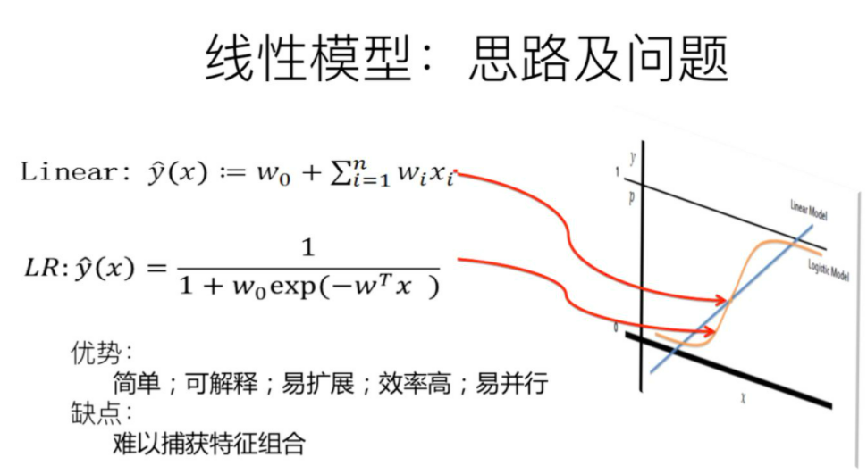
	+ 改进版本1：两两特征交互，得到n*(n-1)/2个交叉项
		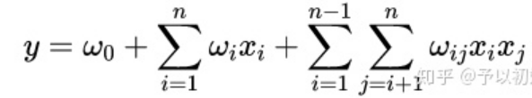
		
		+ 缺点
			+ 组合特征泛化能力差：当x_i * x_j=0时，w_ij参数学习困难，因为梯度为0
		+ 解决方法：对每个特征引入一个向量v，利用<v_i,v_j>来表示w_ij
		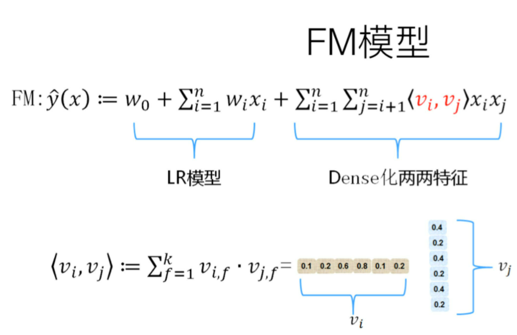
		  
		+ 为什么引入<v_i, v_j>就解决了w_ij学习困难的问题？
		  	+ 削弱了参数间的独立性
			+ 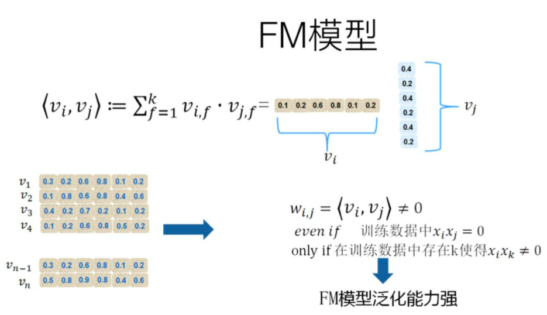
		
		+ 进一步降低复杂度：O(n^2 * k) --> O(n*k)
			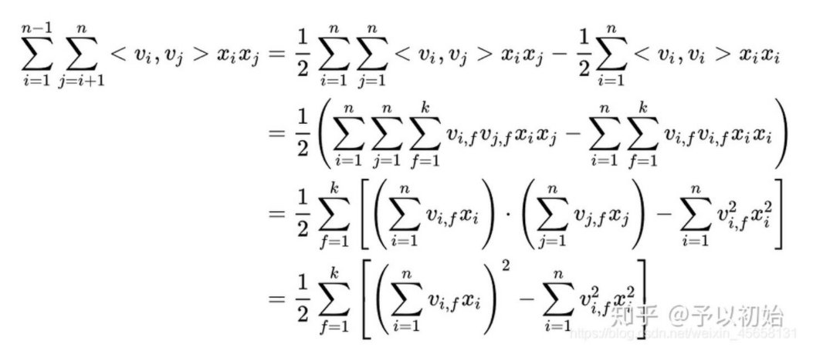
	
	+ FM模型泛化性强的体现？
		+ 通过引入向量表征，能够处理训练中未出现过的特征组合
	+ FM为什么在大规模稀疏特征应用环境下比较好用？
		+ 引入了v_i和v_j，相当于embedding操作；

### 王喆课程
#### 多路召回
+ 多路策略
	+ 热门电影
	+ 风格类型
	+ 高分评价
	+ 最新上映
	+ 朋友喜欢等
	+ Embedding召回
+ 多路召回中，top-k除了根据经验值确定，业界如何确定？
	+ 在系统延迟允许下，k取值越大越好；
	+ 通常，最后推荐结果需要n条，则k取5-10n是比较合适；
+ 如何评价每个召回策略的好坏？
	+ 最好的测试方法是跟排序策略一同测试；
+ 召回是在线的
	
#### 高并发推荐服务的整体架构
+ 3个重要机制
	+ 负载均衡
		+ 利用负载均衡服务器来分发海量请求
		+ 策略
			+ 轮询调度
			+ 哈希调度
			+ 一致性哈希调度：解决哈希调度中存在的无法高效处理故障点问题
	+ 缓存
		+ 当老用户多次请求同样的推荐服务，可以把第一次的请求结果缓存
		+ 当新用户请求时，可以按照一些规则预先缓存好几类新用户的推荐列表
	+ 推荐服务降级
		+ 当服务彻底崩溃的时候，服务降级是最保险、简单、不耗资源的方案
		+ 采用基于规则的推荐方法来生成推荐列表，或者直接在缓存或者内存中提前准备好应对故障的默认推荐列表

#### 局部敏感哈希——如何在常数时间内搜索Embedding最近邻
+ 搜索最近邻的方法
	+ 聚类
		+ k-means：在类别内搜索
			+ 存在问题：边界点可能会遗漏；k的设置不好确定
	+ 索引：通过某种数据结构建立基于向量距离的索引
		+ kd-tree(k-dimension tree)
			+ 存在问题：遗漏最近邻点；结构维护比较复杂；
	+ 局部敏感哈希及多桶策略
		+ 前提条件：欧式空间中，将高维空间的点映射到低维空间，原本接近的点在低维空间中肯定依然接近，但原本远离的点则有一定概率变成接近的点。（低维空间可以保留高维空间相近距离关系的性质）
		+ 局部敏感哈希的基本思想：让相邻的点落入同一个“桶”，使得在最近邻搜索时，仅需要在一个桶内或相邻几个桶内的元素中进行搜索，通过保持每个桶中的元素个数在常数附近，这样就能把最近邻搜索的时间复杂度降到常数级别。
			+ 将embedding与随机向量内积操作后映射到一维空间，利用哈希函数（线上也会使用）进行分桶，考虑到映射会损失部分距离信息，所以采用多个哈希函数进行分桶。最后通过分桶找到相邻点的候选集合后，可以在有限的候选集合中通过遍历找到目标点真正的k近邻。
				+ 简单点说，在离线时，将用户历史浏览过的item，利用内积操作并利用哈希函数进行分桶，线上用的时候就把找到浏览过的item_id，找到其桶号，再将桶号中的其他item_id进行召回。
			+ 如何处理多个分桶之间的关系？
				+ 点数越多，越应该增加每个分桶函数中桶的个数
				+ Embedding向量的维度越大，越应该增加哈希函数的数量，尽量采用“且”的方式作为多桶策略；相反，采用“或”的方式作为分桶策略；
					+ 向量维度越大，说明向量空间越高（复杂），通过增加哈希函数数量来减少不确定性，并且通过“且”的方式来减少数量从而降低时间复杂度；
			+ 每个桶点的规模为C(取决于topN)，假设每个Embedding维度为N，找到最近邻点的时间开销为O(C*N)，采用多桶策略后，假设分桶数量为K，时间开销为O(K*C*N)		
		+ 如何存储和使用在离线产生的分桶数据，以及怎样设计线上的搜索过程？
			+ 倒排索引：以item_id作为key，其对应的BucketId作为value存储在redis中，再以BucketId作为key，item_id作为value存储在redis中，召回的时候遍历item_id的所有BucketId,获取BucketId对应的item_id就是需要召回的item。
#### 模型服务
+ 业界主流的模型服务方法
	+ 预存推荐结果或Embedding结果
		+ 预存推荐结果优点
			+ 无需模型线上推断，线上延迟极低
		+ 预存推荐结果缺点
			+ 当用户数量、物品数量等规模过大后，易发生组合爆炸导致无法存储
			+ 无法引入线上场景类特征
		+ 预存推荐结果适用场景
			+ 用户规模较小，冷启动、热门榜单等特殊应用场景
		+ 预存Embedding结果优点
			+ 线上推断简单快速
		+ 预存Embedding结果缺点
			+ 无法引入线上场景特征
			+ 无法进行复杂模型结构的线上推断，表达能力受限
	+ 预训练Embedding+轻量级线上模型(逻辑回归或浅层神经网络)
		+ 例如阿里的MIMN
		+ 优点
			+ 可以引入线上场景特征
			+ 支持复杂模型结果的线上推断
	+ PMML模型
		+ 优点
			+ 支持End2End训练和部署
		+ 缺点
			+ 较难支持复杂模型
	+ Tensorflow Serving
		+ 优点
			+ 支持End2End训练和部署，支持tensorflow模型结构 
			+ 使用docker容器便于安装、遇到压力时可以灵活增加减少docker容器数量、弹性计算、弹性资源分配
		+ 缺点
			+ 只支持tensorflow模型，线上服务效率较低，需要优化

#### 推荐模型演化图
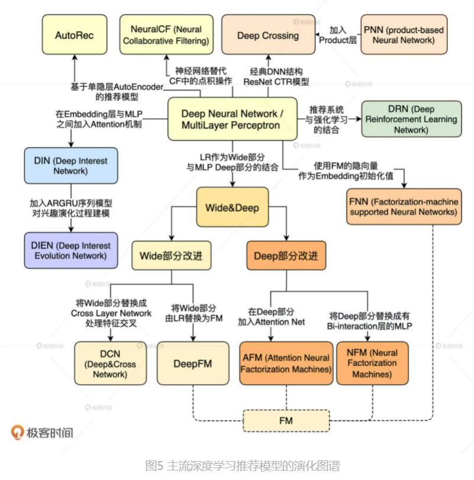

#### 协同过滤(CF)
+ 定义：协同大家的反馈、评价、意见一起对海量信息进行过滤，从中筛选出用户可能感兴趣的信息
+ 下图d中预测X对电脑的评价，可以看到共现矩阵中B和C与X最相近，所以通过B和C对电脑的评价预测出X的评价
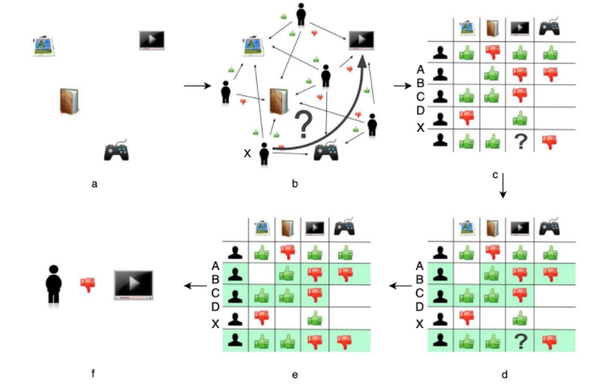

#### 矩阵分解
+ 下图中可以看到矩阵分解就是基于协同过滤得到的user矩阵和item矩阵，user矩阵中每行、item矩阵中每列就代表对应的隐向量(可以看成简单版embedding)
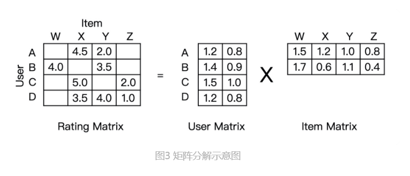
+ 求解方法：梯度下降
+ 损失函数：平方损失函数，即共现矩阵中的值与user矩阵乘以item矩阵中的值必须相等
+ 缺点：泛化能力差，遇到训练数据中行为非常少的情况，推荐结果差

#### Embedding+MLP
+ 模型结构如下图
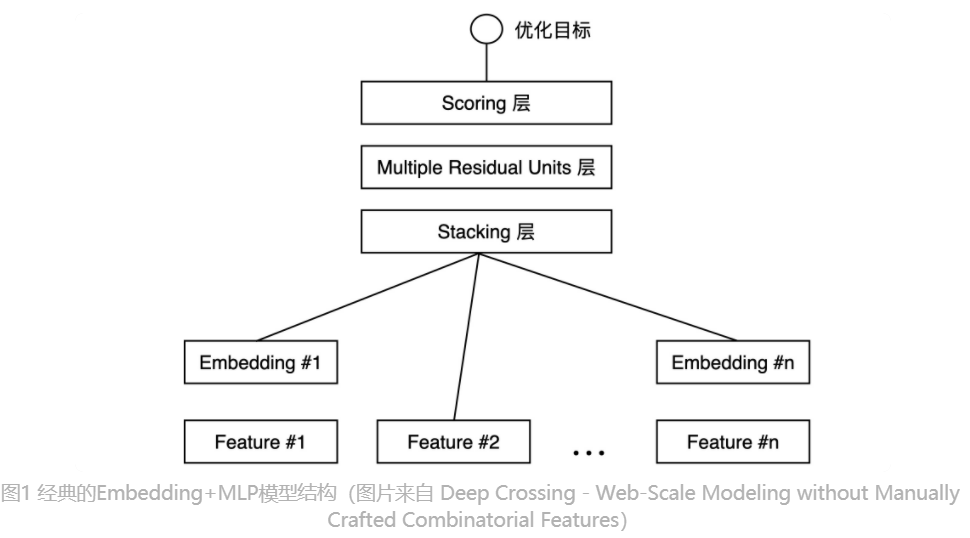
+ 这里，由于embedding采用stacking方式，所以user embedding和item embedding不在一个向量空间；  

#### wide & deep模型
+ 模型如下
  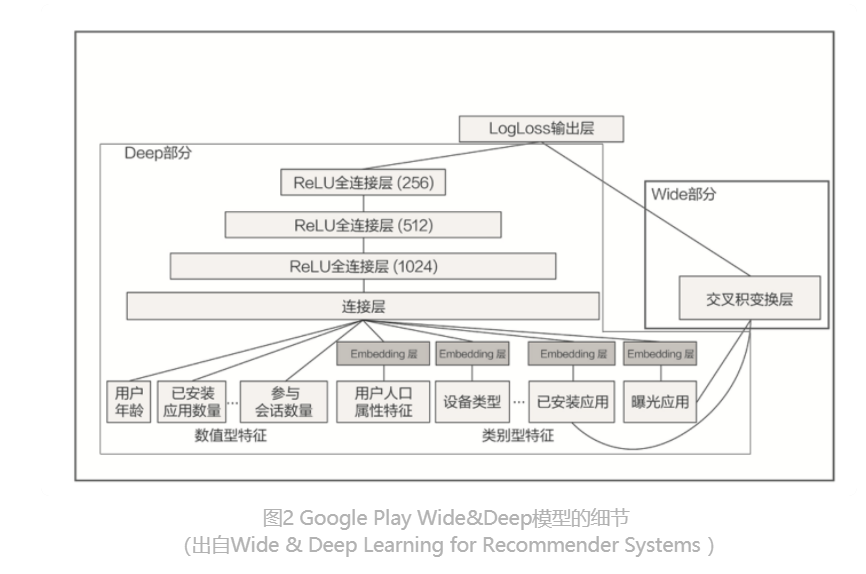
+ wide部分和deep部分分别侧重学习什么信息？
	+ wide部分主要是让模型具有较强的“记忆能力”，可以理解为模型直接学习并利用历史数据中物品或特征的"共现频率"(**一些强规则**)
	+ deep部分主要是让模型具有较强的“泛化能力”，可以理解为模型传递特征的相关性、发掘稀疏甚至从未出现过的稀有特征与最终标签相关性的能力
	+ 模型兼具逻辑回归和深度神经网络的优点：能够快速处理并记忆大量历史行为的特征，并且具有强大的表达能力。
+ wide端是用来干嘛的？
	+ 主要是使用一些交叉后的强特征，可以认为是强规则，这些特征使用one-hot的形式，具有稀疏性；
	+ 能够学习到一定的用户行为信息（DIN中相当于把wide端换成用户行为序列模型了）
	+ 由于这些特征是一些出现在历史数据中，其泛化性非常差（这也是需要deep特征的原因）；
+ deep端是用来干嘛的？
	+ 由于输入是id类特征，比较稀疏，所以需要embedding来控制一下；
	+ 由于wide端只能看到历史数据中存在的一些强特征，对于从未在训练数据中出现的情况，需要deep端进行学习；
	+ 多重交叉组合，使得模型泛化能力增强
+ 由于deep端也能拟合wide端，为啥还需要wide端？
	+ 主要还是工程考虑，线上wide端无延时，而deep端肯定会有一定延时；
	+ 基于当时现状，是一种过渡方案，后续DIN都是在这基础上改的；
	+ 可以实时online学习，而deep端则需要一定batch后在更新；
	
#### NeuralCF
+ 图
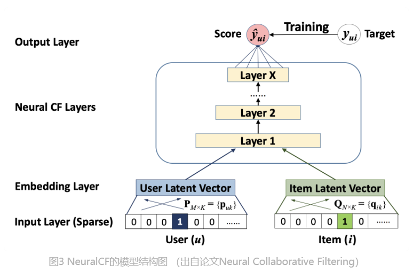
+ 扩展：这个模型有点双塔模型的意思
+ youtube双塔模型
	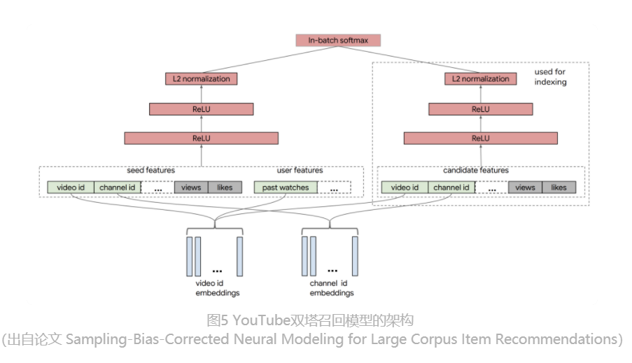
	+ 这里，由于user embedding和item embedding通过**点积**运算，所以两种embedding在同一空间中	 

#### DeepFM
+ 解决Embedding+MLP、Wide&Deep、NeuralCF中特征交叉弱的问题
	+ NN是能拟合任意函数的能力，为什么还是特征交叉弱？
		+ 理论上是这样，但考虑到资源情况，还是比较低效的
+ FM（Factorization Machine，因子分解）模型结构：里面的加号类似于残差连接
	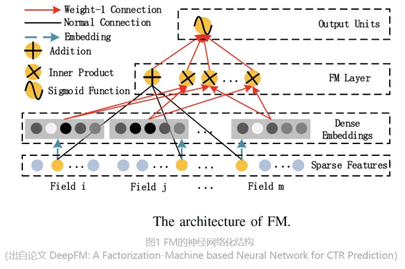
+ DeepFM模型结构
	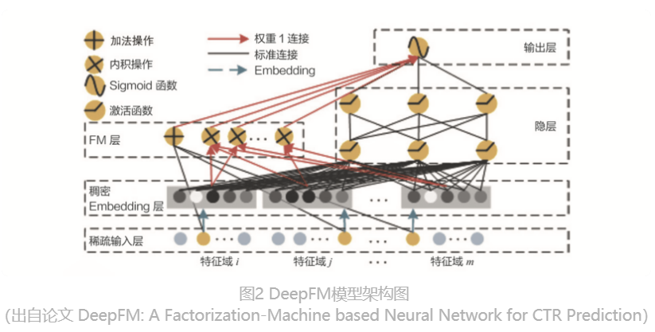
	+ 利用FM结构替换了Wide&Deep模型中的Wide结构
		+ 加强浅层网络部分特征组合的能力
	+ 提出使用**元素积**操作进行特征交叉
		+ 元素积之后，计算所有特征向量和池化
			+ 特征交叉池化层
				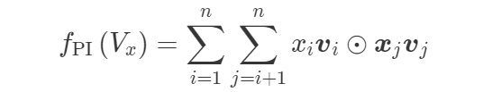
			+ 元素积（与点积区别：对应位置相乘，但不求和）
				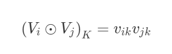

#### 注意力模型
+ DIN的基模型（Embedding MLP结构）
	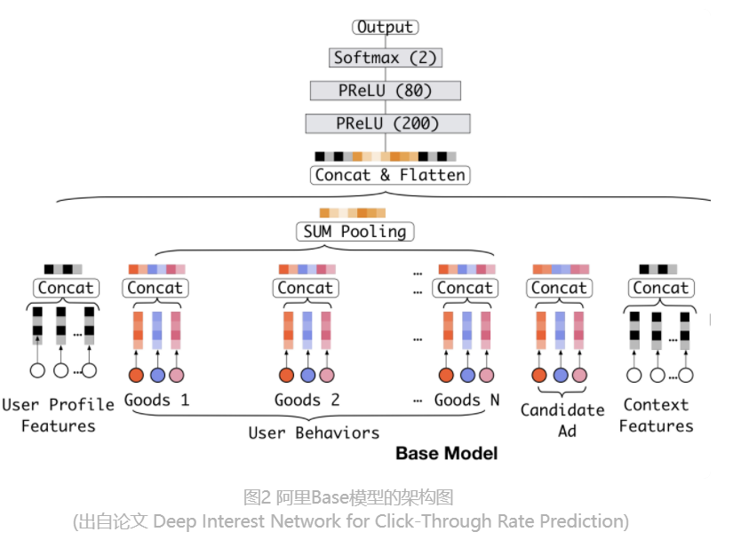
	+ 输入特征
		+ 用户属性特征
		+ 用户行为特征：用户购买过的商品
		  + 商品：商品ID、商铺ID、商品类别ID
		+ 候选广告特征：也是一种商品
		  + 商品：商品ID、商铺ID、商品类别ID
		+ 场景特征
+ DIN模型：兴趣网络模型
	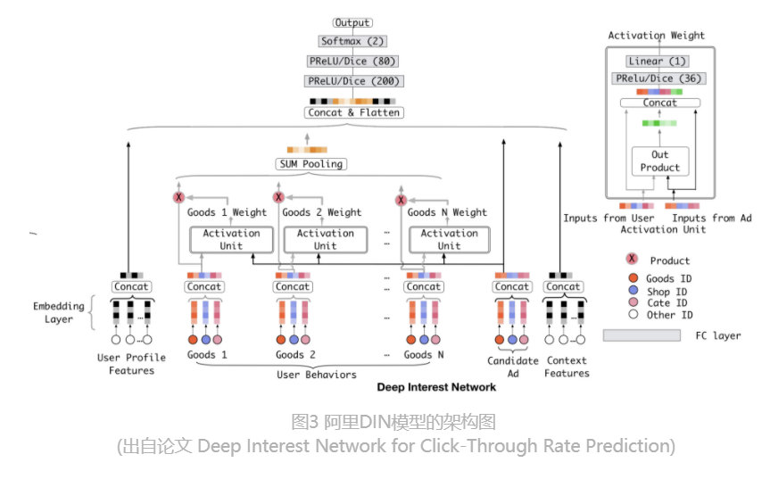
	+ 基模型的改进点：为每个用户的历史购买商品加上了一个激活单元，这个激活单元生成一个权重，这个权重就是用户对这个历史商品的注意力得分
		+ 激活单元的作用：个人理解就是广告商品和历史商品的相关程度，相关度高的权重高
		+ 激活单元中使用了**外积**计算相似性：相比内积，由于外积生成一个向量，表达的信息更丰富
+ DIEN模型：兴趣进化序列模型
	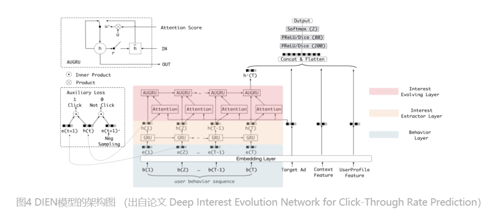
	+ DIN模型缺点：未对用户的行为序列进行建模，无法预测出用户购买商品的趋势
	+ 改进：见图中彩色部分，分3层进化，输出是 h'(t)
		+ 行为序列层(浅绿色)：负责把原始的 ID 类行为序列转换成 Embedding 行为序列
		+ 兴趣抽取层(浅黄色)：利用 GRU 组成的序列模型，来模拟用户兴趣迁移过程，抽取出每个商品节点对应的用户兴趣。
			+ Auxiliary loss：用来增强前后商品的关联程度，这里的loss是来自于是否click，如果能改进成用户浏览商品时长应该会更好一点(因为有些click可能是误触导致的)
		+ 兴趣进化层(浅红色)：利用 AUGRU(GRU with Attention Update Gate) 组成的序列模型，在兴趣抽取层基础上加入注意力机制，模拟与当前目标广告（Target Ad）相关的兴趣进化过程，兴趣进化层的最后一个状态的输出就是用户当前的兴趣向量 h'(T)。
	+ 如果把DIEN直接放到线上用时，因为存在GRU会导致推理速度慢，这个怎么解决？
		+ 可以提前把GRU得到的embedding预存到线上数据库中

#### 强化学习
+ 基本概念
	+ 一个智能体通过与环境进行交互，不断学习强化自己的智力，来指导自己的下一步行动，以取得最大化的预期利益。
	+ 6个必须元素
		+ 智能体
		+ 环境
		+ 行动
		+ 奖励
		+ 状态
		+ 目标
+ 强化学习推荐模型DRN(Deep Reinforcement Learning Network)——微软2018
	+ 应用场景：新闻推荐
	+ 技术框图
	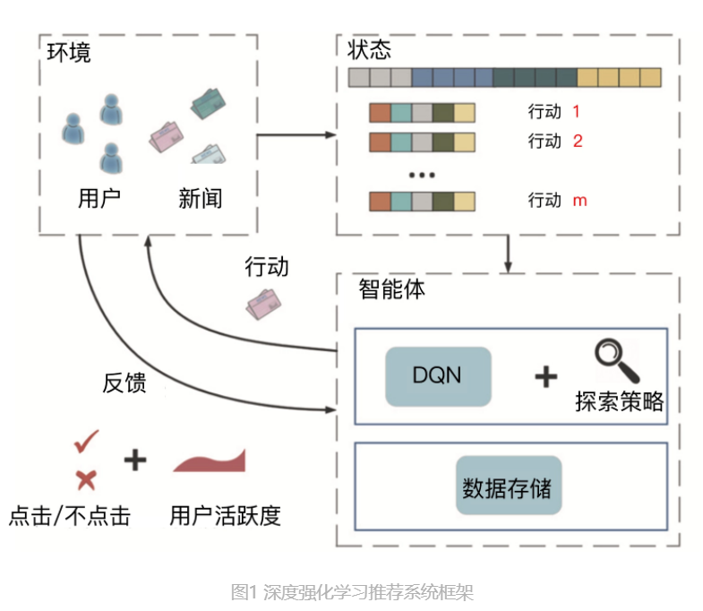
	+ 特点
		+ 持续学习
		+ 实时训练
	+ DRN模型的智能体为DQN
		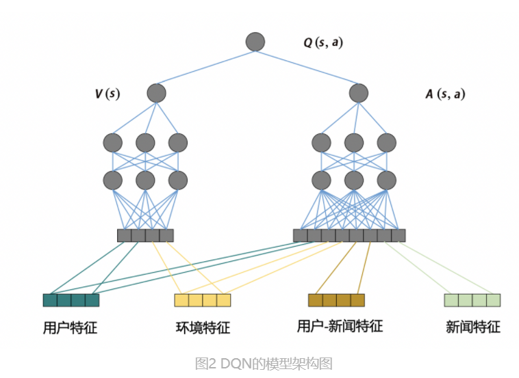
	  	+ 左边是用户塔特征向量，代表用户当前所处的状态，可视为状态向量
	  	+ 右边是物品塔特征向量，可视为行动向量
	+ DRN的学习过程
		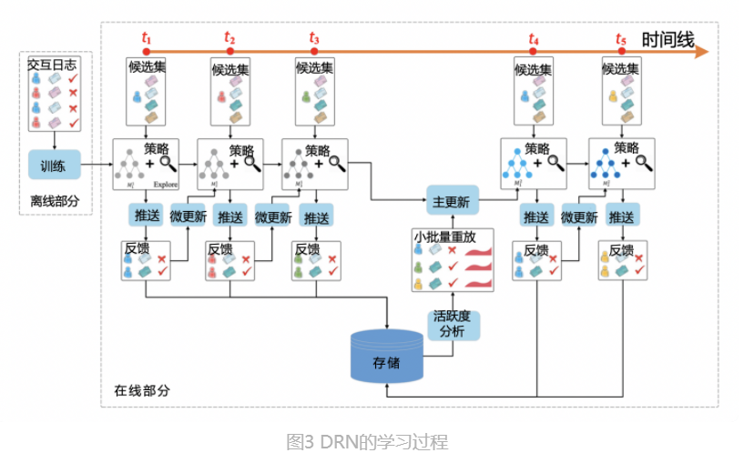
		+ t1-t2-t3时间点，利用积累的用户点击数据进行微更新，t4时间点利用用户点击数据和用户活跃度数据进行主更新，然后不断重复这个过程	  
			+ 主更新：利用历史数据重新寻来你DQN
			+ 微更新(在线学习方法)：竞争梯度下降算法(Dueling Bandit Gradient Descent algorithm)
				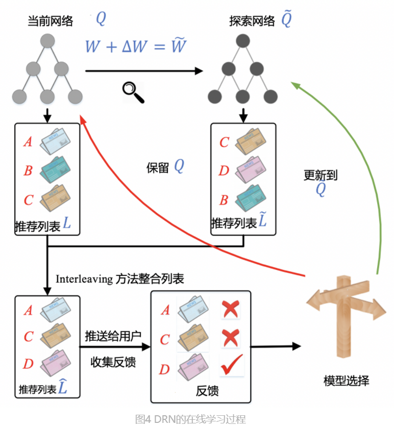
			  	+ 步骤1：给已训练网络Q的模型参数（比较重要的参数）添加一个较小的随机扰动，得到新模型Q'，其中a是探索因子，决定探索力度的大小；
			  		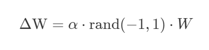
			  	+ 步骤2：对于当前网络Q和Q'，分别生成推荐列表L和L'，再利用间隔穿插(Interleaving)方式融合两个列表，组合成一个推荐列表给用户；
			  	+ 步骤3：实时收集用户反馈，如果Q'的效果优于Q，则用Q'代替Q，反之，保留当前网络。

#### 离线评估
+ 常用方法
	+ Holdout检验法：**随机**将原始样本集合划分成训练集和测试集，**缺点是评估结果有一定随机性**
	+ 交叉检验：为了解决Holdout的问题，将样本分成K组，取K个结果的平均值。**缺点是当样本规模比较小时，会影响模型训练效果**
	+ 自助法：通过有放回的方式随机抽样从总数为N的样本集合得到大小为N的训练集，剩余未抽出的样本作为验证集。**缺点是会改变样本分布**
	+ 时间切割：按时间划分训练集和测试集，避免信息穿越。训练集和测试集比例控制在3：1至10：1之间。**缺点是整个评估过程是静态的，模型不会随着评估的进行而更新**（如果离线测试中使用5天数据作为测试集，而生产上模型是日更新的，那离线测试并没有在5天的评测过程中做到日更新）
	+ 离线Replay：解决时间切割方法中无法动态更新的问题。在离线测试时，使用动态方式进行离线评估，**更接近真实线上环境**。**缺点动态更新的工程实现难度大**
		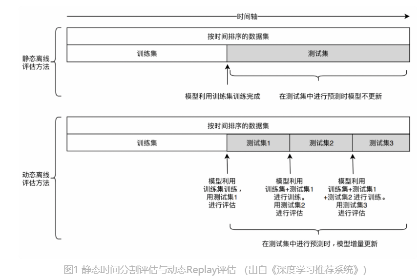
+ 评价指标
	+ 准确率
	+ 精确率和召回率
		+ F1：精确率和召回率的调和指标
		+ 推荐系统中把Top N结果认为是模型判定的正样本，分别计算Precision@N和Recall@N
	+ 对数损失
	+ 均方根误差
	+ P-R曲线：衡量模型的好坏指标，横轴代表召回率TPR，纵轴代表精确率
	+ ROC曲线：衡量模型综合性能的指标，横纵是FPR（假阳性率），纵轴代表TPR（真阳性率）
	  	+ AUC：越大，推荐效果越好
	+ 平均精度均值mAP：对每个用户计算一个AP值后再对所有用户的AP值进行平均。
		+ 平均精度AP：取正样本的precision进行平均，下图为某个用户的AP=（1/1+2/4+3/5+4/6）/4
			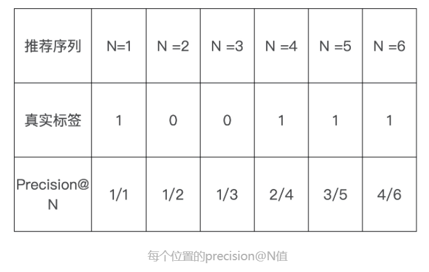
	+ 归一化折扣累计收益：NDCG
	+ 覆盖率
	+ 多样性

#### 在线测试——A/B test
+ 定义：又称分流测试、分桶测试，通过把被测对象随机分成A、B两组，分别对它们进行对照测试的方法得出实验结论。比如推荐系统领域，先将用户随机分成实验组和对照组，然后给实验组用户施以新模型，给对照组用户用旧模型，经过一定时间测试后，计算实验组和对照组各项线上评估指标，比较新旧模型的效果差异，挑选效果最好的模型。
+ 优点
	+ 1、离线评估不考虑线上环境的延迟、数据丢失等情况，很难还原线上细节，评估结果存在一定失真现象
	+ 2、线上系统的某些商业指标再离线评估中无法计算，比如用户点击率、留存时长、PV访问量等。
	+ 3、离线评估无法完全消除数据有偏现象（离线数据是利用当前算法生成的数据，是非客观的）
+ 分桶原则(**保证公平公正**)
	+ 样本的独立性：同一个用户在测试全程只能被分到同一个桶
	  	+ 为什么同一个用户只能被分到同一个桶？
	  		+ 因为如果让用户在不同桶之间切换，会严重损害用户的实际体验，也会让不同组实验的结果相互影响。
	+ 分桶过程中的无偏性：用户被分到哪个桶都是随机的
+ 分层原则(**保证互不干扰**)：由于实验过程中，可能会发生多个A/B test情况，比如前端、后台等
	+ 正交性：层与层之间流量正交，一批实验用的流量穿越每层实验后都会被随机打散用于下一层实验
	+ 互斥性：同层之间流量互斥，多组A/B测试之间流量不可以重叠、同组A/B测试中实验组和对照组流量不重叠
+ A/B test评估指标
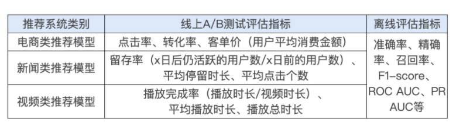
+ 如何解决A/B test测试资源紧张的窘境？
	+ 建立一套评估体系
		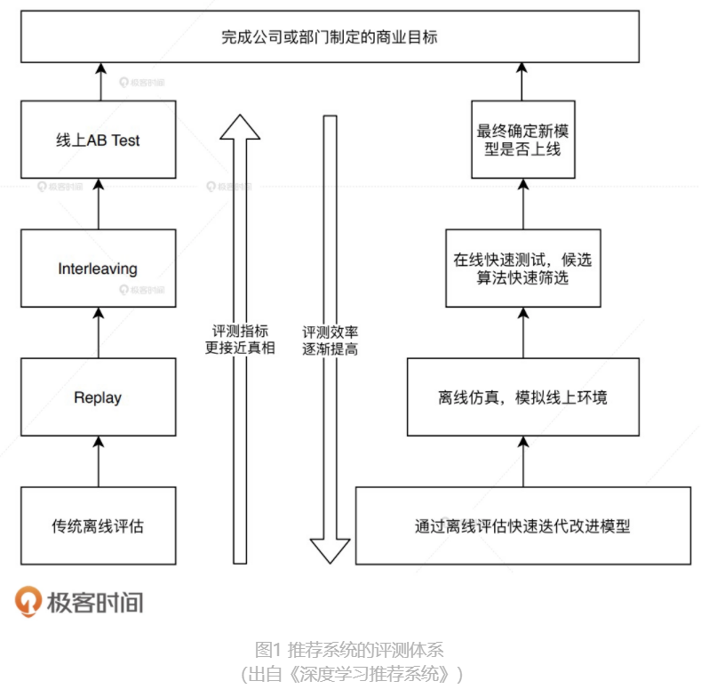
  	+ 离线replay方法：将每天的数据保存成一个快照(snapshot)
	+ Interleaving方法
		+ 意义
			+ 和A/B test一样的在线评估方法，能够得到在线评估指标
			+ 比A/B test使用更少的资源，更快的速度得到在线评估结果
		+ 具体实现：跟A/B test不同，它只需要一组用户，这组用户会收到模型A和模型B的混合结果(结果与模型有对应关系)，在评估过程中，Interleaving方法通过分别累加模型A和模型B推荐物品的效果，来得到对模型A和模型B最终的评估结果。
		
	  	+ 假如混合推荐结果中有一个模型的结果位置靠前，那Interleaving方法如何保证对模型A和模型B的测试公平性？
			+ 必须以等概率的方式混合模型A和模型B的结果，比如模型A和模型B的第一个结果以等概率的方式决定先选谁
		+ 存在问题：无法替代A/B test，因为测试一些用户级别的在线指标时就不能用Interleaving，比如用户留存率，因为混合结果用户都点击的话，虽然知道点击结果是来自某个模型，但是到底是哪个模型使用户存活下来无法知道。而像CTR、播放量、播放时长这些指标，Interleaving方法可以替代A/B test，因为它是模型级别的指标，是模型直接带来的效果。

#### 前沿拓展
##### 业界经典——YouTube
+ youtube推荐系统整体架构
	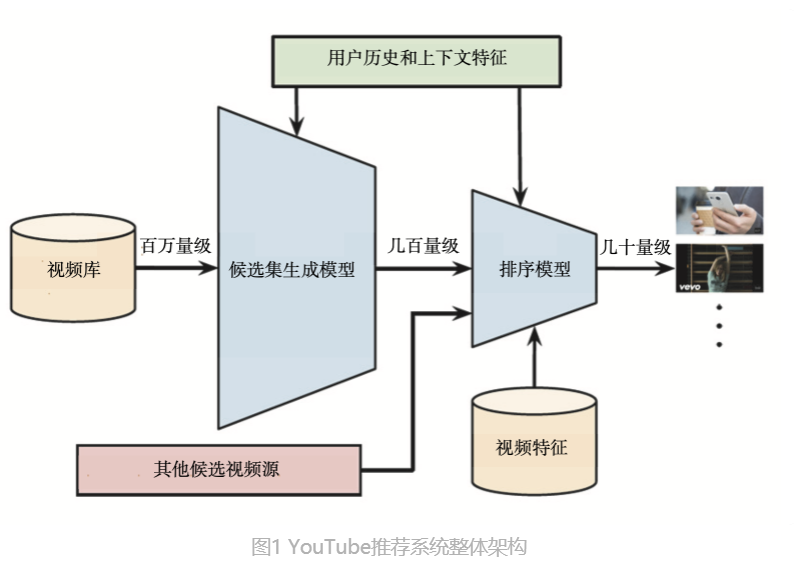
	
	+ 召回层
	  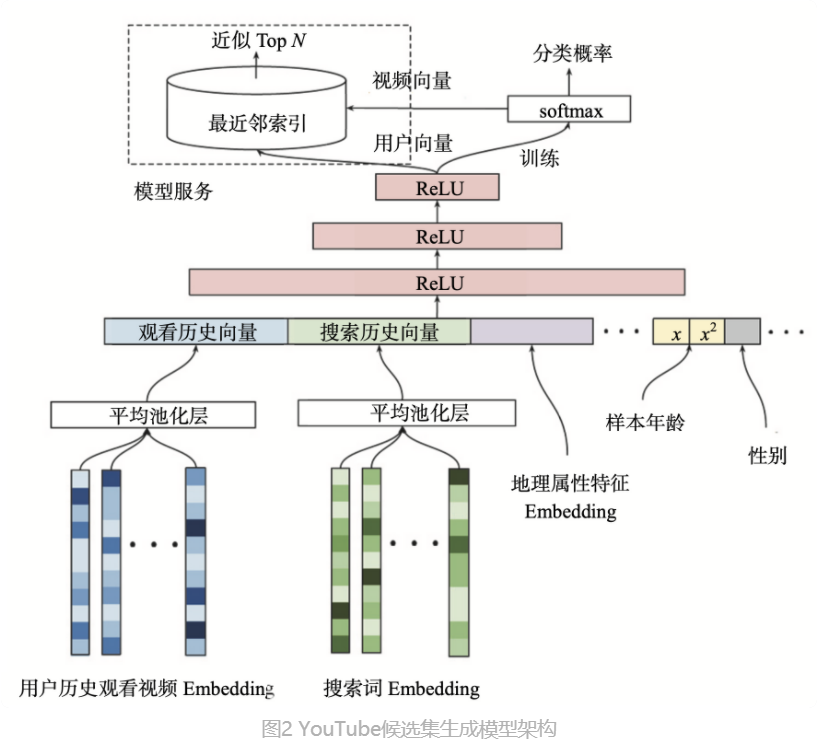
	  
		+ **输出层是要预测用户会点击哪个视频**，不是预测用户会不会点击这个视频
		  	+ 训练方式：word2vec
			+ 分类标签是所有视频ID：使用“视频ID”标签来代替“用户会不会点击视频”
			+ 输出是一个在所有候选视频上的概率分布
			+ 为什么要预测用户会点击哪个视频？
				+ 为了更好、更快地进行线上服务
		+ 模型线上服务：采用最近邻搜索方法
			+ 通过生成用户和视频的Embedding，通过最近邻搜索提高模型服务效率，就不需要e2e的推理
		+ **用户Embedding来源**：最后一层ReLu的输出向量
		+ **视频Embedding来源**：**softmax层的参数矩阵**，本质上是一个m×n维矩阵，这里m是用户向量维度、n是所有视频数量，矩阵每列代表视频embedding。（类似于word2vec中词向量矩阵来自于参数矩阵是一样的）
		+ 为什么用户Embedding和视频Embedding是在同一空间的？
  			+ 因为softmax的输入x是用户Embedding，经过前向计算w_i*x+b后得到了物品i节点值，这里的w_i就能代表物品向量了(类似点积)，相当于利用用户向量参与计算生成了最后的物品向量，所以两种向量在同一空间。
		+ 为什么最后一层ReLu的输出是用户Embedding？
  			+ 因为所有输入特征都是用户特征
		+ 样本年龄如何理解？
			
	+ 排序层
		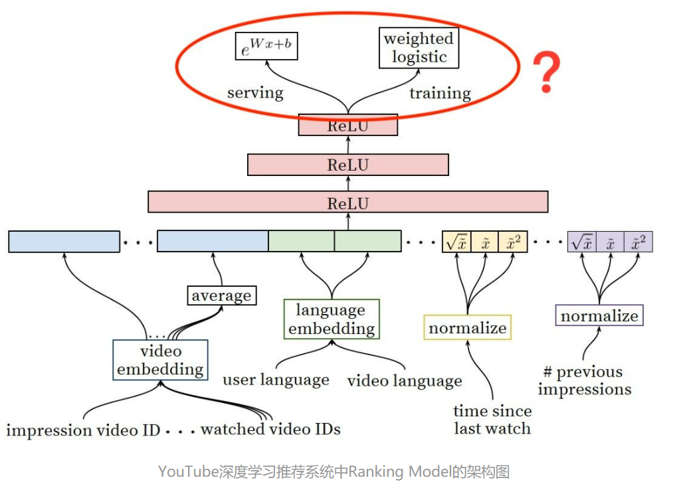
	  	
		+ 输入层
	  		+ 当前候选视频的Embedding：impression video ID
	  		+ 用户观看过的最后N个视频Embedding的平均值：watched video ID
	  		+ 用户语言的Embedding和当前候选视频语言的Embedding
	  		+ 用户上次观看同频道距今的时间：如果用户看过同频道，说明用户有一定兴趣
	  		+ 该视频已经被曝光给该用户的次数：previous impressions，如果曝光太多都未点击，说明用户不感兴趣
	  	+ 输出层：**weighted logistic regression**
	  		+ 预测目标：用户是否点击当前视频
	  		+ **为什么要采用加权逻辑回归作为输出层？**
	  			+ 因为用户的观看时长才是商业指标，而逻辑回归能实现这样的目标。
			+ 为了实现预估观看时长，如何实现加权逻辑回归的？
	  			+ 为每个样本设置一个权重，将正样本的权重设置为用户观看这个视频的时长，利用加权逻辑回归训练学习到用户观看时长信息。
	  	+ weight logistic regression如何训练的？
			+ 第一种，样本重复抽样weight次
			+ 第二种，更改LR的loss
		+ 这里，线上服务可以采用召回层的方法吗？
	  		+ 不可以，召回层只使用了用户特征，而排序层使用了用户和视频特征；第二，排序层的输出不再是预测视频ID，所以无法拿到视频的Embedding。
	  	+ 那排序层如何线上服务？
	  		+ tensrflow-serving等端到端推理模型服务
		+ 为什么线下使用加权逻辑回归，线上使用e^(wx+b)？
			+ odds = p / (1-p) = e^(wx+b)
			+ 加权odds = tp/(1-tp)，由于用户点击视频的概率p非常小，加权odds = tp，这里tp是期望观看时长，这样就能线下使用加权逻辑回归，线上使用期望观看时长指标

##### 图神经网络——Pinterest的GraphSAGE
+ 传统图神经网络：基于随机游走的间接性Graph Embedding
	+ 例子：DeepWalk、Node2Vec
	+ 缺点：会损失一定信息
	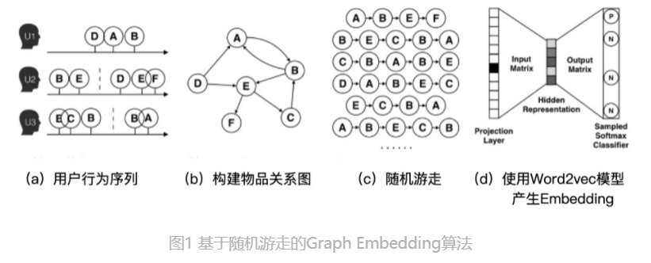
+ GraphSAGE：Graph Sample And Aggregate
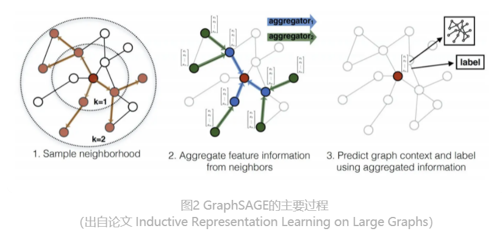
	+ 主要步骤：抽样-聚合-预测
		+ 第一步，在整体的图数据上，从某一个中心节点开始采样，得到一个k阶子图；
		+ 第二步，利用GNN把k阶的邻接点进行聚合，最后聚合成这个中心节点；
		+ 第三步，利用这个聚合好的中心节点的Embedding，去完成一个预测任务。
	+ GraphSAGE模型结构
	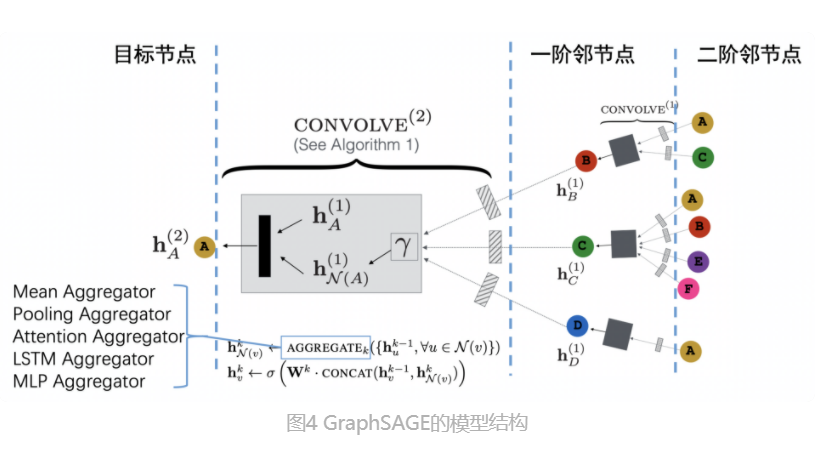
	  
		+ GNN输入是二阶邻接点的Embedding，二阶邻接点Embedding通过CONVOLVE操作生成一阶Embedding，再通过CONVOLVE生成目标中心点Embedding。
		+ CONVOLVE操作是什么？——由Aggregate操作和Concat操作组成的复杂操作
			+ 第一步是Aggregate操作，上图中gamma符号表示，将点A的3个邻接Embedding进行聚合得到h_N(A)；
			+ 第二步是将h_N(A)和点A上一轮训练中的Embedding(h(A))进行Concat，通过一个全连接层生成点A的新Embedding。
		+ GNN如何训练生成中心节点Embedding？
			+ 预测目标
				+ 有监督：将输出层设计成逻辑回归等
				+ 无监督：类似word2vec输出层的设计，预测每个点的ID
	
	+ GraphSAGE在Pinterest推荐系统中的应用——PinSAGE
	+ 优点
		+ 可以直接处理图结构数据，不需要转换成序列数据
	+ GraphSAGE是为了生成每个节点的Embedding，那能不能加入物品的其他特征？
		+ 可以，第一种是在Concat处拼接；第二种是在过全连接层前拼接；
	+ GraphSAGE多用于相似物品推荐item2item，图结构中边表示用户行为

##### 流处理平台——Flink是如何快速识别用户兴趣进行实时推荐的
+ 为什么说实时性是影响推荐系统效果的关键因素？
  	+ 只有拥有实时抓住用户兴趣点的能力，才能留住客户。
+ 什么是批流一体的数据处理体系？
	+ 批处理架构
	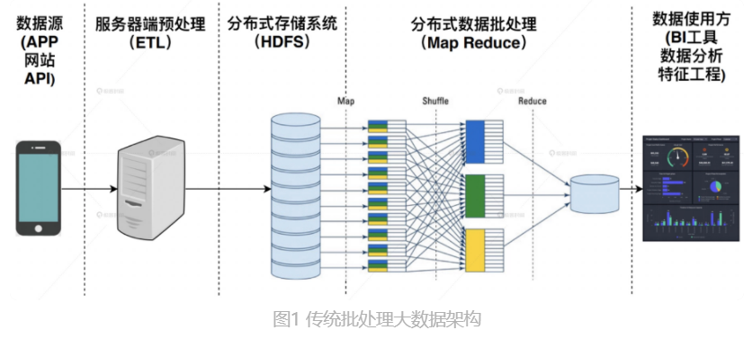
	  
		+ 特点：慢，数据中间要存储
	+ 流处理架构
	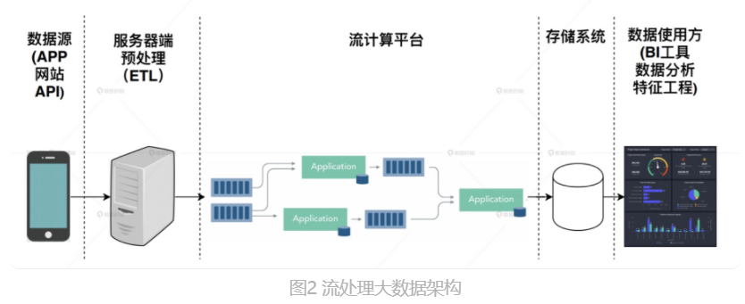
	  
		+ 特点：数据源和计算平台之间没有存储环节，但无法进行长时间段的历史数据的全量处理。
	+ 批流一体处理架构——Flink
	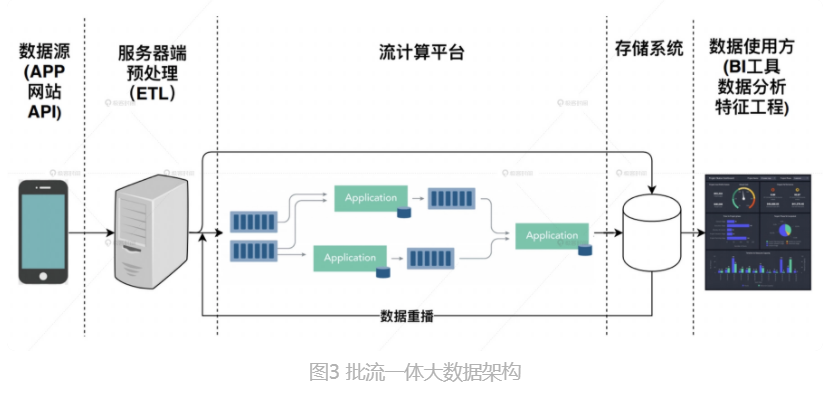

		+ 特点：在流处理架构的基础上添加了数据重播功能，即对落盘数据进行再处理
		+ 难点
			+ 一，从传统批处理平台进行迁移到批流一体平台，具有沉重的技术负担
			+ 二，批流一体的解决方案比较理想化，在实际处理特征时，很难让批处理和流处理完全共享一套代码，比如数据时间跨度大的特征，流处理很难实现。
		+ Flink如何进行流数据处理？——按照时间窗口来处理每个时间窗口内的数据
		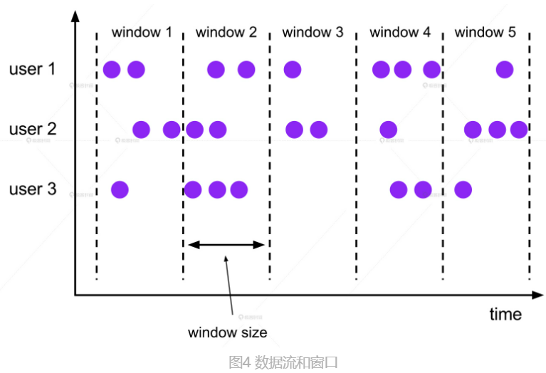
		  
			+ 数据流：即消息队列
			+ 窗口

##### 模型迭代——阿里巴巴是如何迭代更新推荐模型
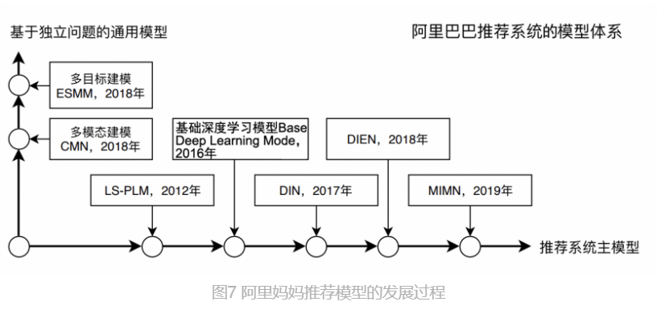
+ based model：Embedding+MLP
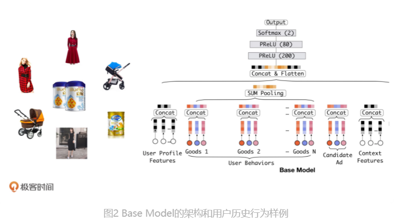

+ 历史行为序列
	+ DIN：引入注意力机制计算每个历史行为和当前要预测的候选广告物品之间的关系，关系紧密的权重大
	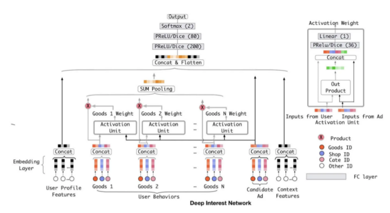
		
	+ DIEN：除了注意力机制，还要考虑商品的购买时间引入用户历史行为
	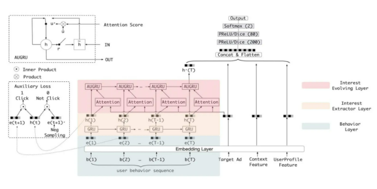
	
	+ MIMN：DIEN虽然考虑了序列结构，但是所有历史行为都是在一条线上演化的，而事实上用户的兴趣演化过程完全可以多条并行
	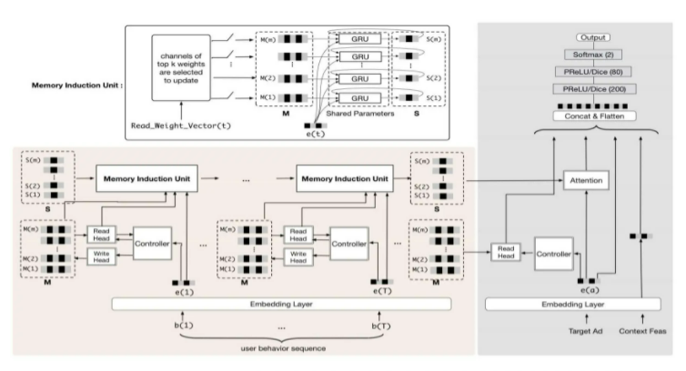

+ 商品图片信息
	+ DICM(Deep Image CTR Model)
	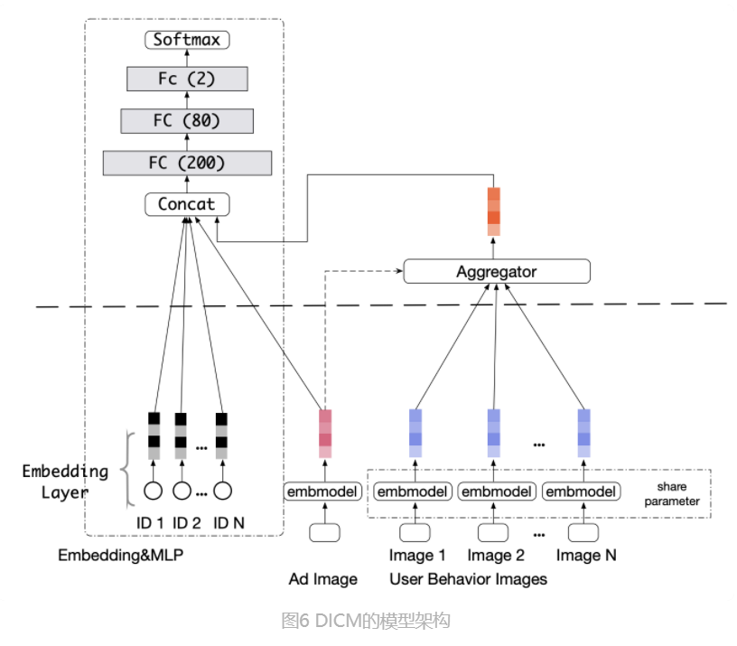

##### 技术权衡——解决方案这么多，哪个最合适
+ 制约条件
	+ 软硬件环境的制约
	+ 研发周期的制约
	+ 实际业务逻辑和应用场景的制约
+ Redis容量和模型上线方式之间的权衡
	+ 考虑因素
		+ 模型参数规模尽量小
		+ 考虑线上预估延迟和特征存储空间有限的情况，线上预估所需特征数量要根据重要性做一定删减
	+ 解决方式：舍弃一些次要因素，关注主要矛盾
		+ 对于千万量级甚至更高量级的特征向量维度(理论上模型参数也在这个级别)：关注模型的稀疏性和复杂性，舍弃准确度换取线上速度和资源消耗
			+ 提高稀疏性：加入L1正则化项、采用FTRL这类稀疏性强的训练方法
			+ 降低复杂度：减少网络层数和神经元数量
		+ 明确多种备选方案，实现各种方案组合，进行离线和线上的效果测试。
		+ 特征侧：特征筛选
+ 研发周期和平台迁移之间的权衡
  	+ 集中团队力量完成迁移，并在新平台上进行新模型和新功能的研发
  	+ 保留成熟稳定的平台，快速满足产品需求，为迁移留时间（建议）
+ 冷启动等业务逻辑对推荐模型的制约
	+ 加快模型更新速度
		+ 优化模型训练环节
		+ 降低模型复杂度
		+ 增加策略

#### 深度学习需要什么推荐工程师
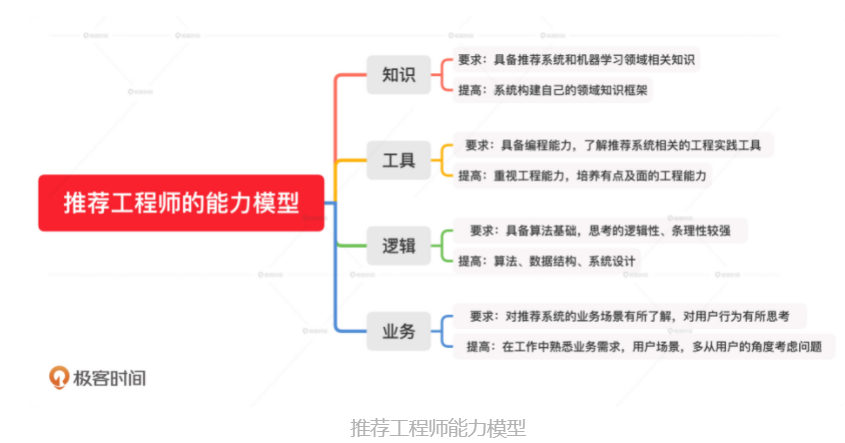

### 面试题
+ 点击率预估任务中负样本过多怎么办？（样本不均衡问题）
	+ 采样处理
	+ 类别权重
	+ 一般情况下，正负样本的关系控制在1：2或1：3

+ 如何降低热门电影对推荐结果的影响？
	+ 利用tf-idf的方式给训练样本一个权重来降低影响

+ 双塔模型的优势
	+ 易上线、易服务
		+ 双塔模型在互操作层之前分别是user-embedding和item-embedding，直接存入缓存数据库就行
		+ **如果把一些场景特征，比如当前时间、地点加入到user侧和item侧，那预存embedding上线的方式是否可行？**
			+ 不行，因为线上场景特征是不断变化的
		+ 那什么情况下可以加入场景特征？
			+ 如果线上部署了模型，那就加入场景特征与其他特征一起让模型推理得到embedding，比如Embedding+MLP方式部署
	+ **如果有场景特征，一般不用双塔模型**
	
+ 对于新闻推荐等时效性很强的场景，不建议使用ID类特征，可以使用比如新闻的类型、人物、地点、关键词等
+ DeepFM中特征交叉使用的是类别型特征，那如何让连续性特征参与特征交叉？
	+ 对连续型特征进行分桶，然后在映射到Embedding后参与交叉
+ 推荐模型中隐层层数都比较浅，这是为什么？
	+ 第一，输入特征已经做过一定处理；增加隐层带来的提升非常小；
	+ 第二，考虑到线上服务要求；
+ 对于DIN或DIEN中，假如商品个数大于或小于N怎么办？
	+ 大于N的话，取最近N个
	+ 小于N的话，利用masking
+ 推荐系统中特征预处理会放在线上部分的哪里完成？是在tensorflow serving部分，还是推荐服务器内部，还是离线部分完成？
	+ 特征预处理不会放在tensorflow serving部分进行处理——减小延迟
	+ 对于静态特征，长时间不变的，可以离线部分先处理好预存到线上存储中
	+ 对于动态特征，可以利用流式处理平台实时处理放到线上存储中
+ 离线Replay方法和增强学习有什么相似之处？两个有什么更深层次的关系吗？
	+ 都是动态更新模型，需要不断测试和再训练模型。
	+ 增强学习是通过不断接受反馈在线更新模型，所以评估方法中不能引入未来信息，而简单的时间切割评估方法不能模拟模型的更新频率，所以离线Replay方法是增强学习的唯一离线评估方法。
+ 在A/B test中，一个实验是在首页测试新的推荐模型，另一个实验是在内容页测试新的推荐模型，这两个实验应该放在同一层还是不同层？为什么？
	+ 如果具有相关性，那应该放在同一层，因为首页推荐的结果会使得内容页的用户是有偏的
	+ 如果不具有相关性，则放在不同层
+ Interleaving方法中，假如模型A和模型B的结果中有重叠怎么办？
	+ 随机分配，这次给模型A，下次给模型B就行，只要保证去重后是等概率
+ DIN模型中注意力机制具体指什么？具体结构是什么？能否写出注意力单元的形式化定义，并推导梯度下降更新过程？

