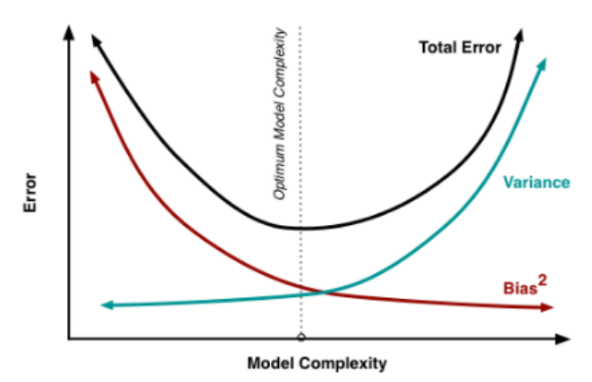

## 入门机器学习后的“随笔”

- [目录](#)
	- [偏差和方差](#偏差和方差)
	- [欠拟合underfitting](#欠拟合underfitting)
	- [过拟合overfitting](#过拟合overfitting)	
	- [梯度消失和梯度爆炸](#梯度消失和梯度爆炸)	
	- [归一化](#归一化)	
    - [熵](#熵)
	- [贝叶斯分类方法](#贝叶斯分类方法)
    - [分类问题中用one-hot形式做label和用数字大小做label的分析](#分类问题中用one-hot形式做label和用数字大小做label的分析)
	- [海量离散特征用简单模型,少量连续特征用复杂模型](#海量离散特征用简单模型少量连续特征用复杂模型)
	- [Logistical Regression](#LogisticalRegression)	
	- [SVM](#SVM)	
	- [LR和SVM的异同](#LR和SVM的异同)
	- [EM算法](#EM算法)
	- [隐马尔科夫模型](#隐马尔科夫模型)
	- [决策树](#决策树)
	- [集成方法](#集成方法)	
	- [Random Forest](#RandomForest)	
	- [GBDT](#GBDT)		
	- [XGBoost](#XGBoost)
    - [Lightgbm](#Lightgbm)
    - [降维](#降维)
    - [聚类](#聚类)
	- [Gradient Descent](#GradientDescent)
	- [贝叶斯信念网络](#贝叶斯信念网络)
	- [使用频繁模式分类](#使用频繁模式分类)
	- [L1、L2正则](#L1L2正则)	
	- [Metrics](#Metrics)
    - [因果关系检验](#因果关系检验)
	- [选择模型](#选择模型)	
	- [机器学习中的"稳定性"](#机器学习中的稳定性)
    - [特征工程与数据处理](#特征工程与数据处理)
    - [GBDT+LR](#GBDTLR)
    - [深度学习](#深度学习)
        - [知识蒸馏](#知识蒸馏)
        - [图卷积神经网络](#图卷积神经网络)
        - [深度学习为啥不使用交叉验证进行模型参数调整](#深度学习为啥不使用交叉验证进行模型参数调整)
    - [基础线性代数子程序](#BLAS)
        - [Linear](#Linear)
        - [GEMV](#GEMV)
        - [GEMM](#GEMM)
	- [模型部署](#模型部署)
        - [机器学习模型](#机器学习模型)
        - [深度学习模型](#深度学习模型)
	
----
	
### 偏差和方差
+ 偏差：算法期望预测和真实预测之间的偏差程度。反应的是模型本身的拟合能力。
+ 方差：度量了同等大小的训练集的变动导致学习性能的变化，刻画了数据扰动导致的影响。
-----

### 欠拟合underfitting
+ **解决措施**
	+ 添加其它特征项（增大数据量）
	+ 添加多项式特征（增加网络层数）
	+ 减少正则化参数
	
### 过拟合overfitting
+ **解决措施**
	+ 重新清洗数据
	+ 增大数据的训练量
	+ 采用正则化方法
	+ 采用dropout法
	+ 提前终止训练
	+ 减少网络层数

### 梯度消失和梯度爆炸
+ **原理**
	+ 梯度消失：当网络层数很深时，如果梯度小于1，则会使得经过多层后向反馈后的梯度累乘远远小于1；
	+ 梯度爆炸：与梯度消失相反，当网络层数很深时，如果梯度大于1，则会使得经过多层后向反馈后的梯度累乘远远大于1；

+ **解决措施**
	+ 1. 激活函数的选择（使用ReLU代替sigmoid、tanh等）
	+ 2. 预训练 + 微调
	+ 3. 使用Batch Normalization
	+ 4. 使用残差网络结构
	+ 5. 使用LSTM网络
		+ 为什么LSTM比RNN更能解决梯度消失的问题？
			+ 因为在RNN中，BPTT的梯度是累乘形式，而RNN的输出中采用了tanh激活函数，所以会出现梯度消失问题；而LSTM的梯度除了累乘形式，还有累加形式，所以不容易出现梯度消失。
		+ LSTM中用sigmoid激活函数，而不用ReLU激活函数的原因？
			+ 因为在LSTM中，忘记门和更新门是起筛选作用，所以需要0~1之间的值作为概率来进行筛选。
	+ 6. 梯度剪切、权重正则

----
	
### 归一化
+ **机器学习为什么对数据进行归一化？**
	+ 归一化的目的：
		+ 处理不同规模和量纲的数据，使其缩放到相同的数据区间和范围，以减少规模、特征、分布差异对模型的影响。
		+ 归一化加速GD求解最优解的速度。比如收敛路径呈Z字型，导致收敛太慢；
		+ 归一化可能提高精度。
	
+ **机器学习什么情况下对数据进行归一化？**
	+ 使用了梯度下降算法，如LR、SVM等；
	+ 计算样本点距离时，如KNN、K-Means等。
	+ ......
+ **机器学习什么情况下不需要归一化？**
	+ 概率模型（决策树）不需要归一化。

+ **如何应用到训练集、测试集和验证集中？**
    + 由于测试集是未知的，所以测试集的归一化的均值和方差应该来源于训练集。验证集同理.
    + 

+ **常用的归一化方法及适用情景**
    + zero-mean法：均值方差归一化；处理后的数据符合**标准正态分布**，**常用于距离度量相似度的聚类算法中**。
	+ max-min法：容易受极端值的影响，一定程度上会破坏原有的数据结构；
	+ z-score法：会改变原有数据的分布，不适合对稀疏数据做处理，不适合根据变量差异程度的聚类分析；
    + 非线性归一化：log、exp、actan、sigmoid等，取决于输入数据范围以及期望的输出范围。
    + length-one归一化：x/||x||这种处理用在不考虑向量大小而需要考虑向量方向的问题中，比如在一些文本情感的分类中，我们可能并不需要知道情感表达的强弱，而只要知道情感的类型，比如开心，生气等等。，将特征转换为单位向量形式，可以剔除特征的强度的影响。
	+ RobustScaler：适用于存在离群点的数据。
	+ 上述方法分析：在分类中，聚类算法，数据符合正态分布中，需要使用距离来度量相似性或者使用PCA降维时，z-score表现得较好。在不涉及距离测量，协方差计算，数据不太符合正态分布时，可以使用第一种方法或其他方法。

+ **LR归一化问题，什么情况下可以不归一化，什么情况下必须归一化，为什么？**
	+ ......
-----

### 熵
+ 信息熵
    + 对于给定事件A，其包含多少信息量，即自信息量；越不可能的事件信息量越大；
    + 公式：H(A) = -P(A)*logP(A)
+ 交叉熵
    + 从事件A的角度如何描述事件B
    + 公式：H(A,B) = -P(A)*logP(B)
+ KL散度
    + 事件B与事件A的分布差异
    + 公式：D(A||B) = P(A)*logP(A) - P(A)*logP(B) = -H(A)+H(A,B)
+ KL散度与交叉熵的区别
    + 相同处
        + 都不具备对称性
        + 非负
        + 当P(A)*logP(A)为常数时，即**事件A是确定性事件，KL散度就是交叉熵**

----

### 贝叶斯分类方法
+ **贝叶斯定理**
	+ 后验概率：P(H/X)，在条件X下，H的后验概率；P(X/H)，在条件H下，X的后验概率；
	+ 先验概率：P(H)，H的先验概率；P(X)，X的先验概率。
	+ 定理：P(H/X) = (P(H)*P(X/H)) / P(X)

+ **朴素贝叶斯分类**
	+ 前提条件：
		+ 基于贝叶斯定理；
		+ 特征条件独立假设：用于分类的特征在类确定的条件下都是条件独立的。**朴素的原因**
	+ 后验概率最大化准则：max P(H/X)，相当于期望风险最小化。
	+ 遇零概率值的处理方法：拉普拉斯平滑，即在极大似然估计计算中，分子加1，分母加K，K为类别数。
	+ 对于连续值属性
		+ 假定连续值属性服从均值为u，标准差为a的高斯分布。
	

----

### 分类问题中用one-hot形式做label和用数字大小做label的分析
+ 其实不一定必须用one-hot，**用one-hot的主要因素**
    + **one hot的形式无法比较大小**
    ```
    举例：
    （1）标签不存在直接比较关系。如果要预测的label是苹果、雪梨、香蕉、草莓这四个，显然他们不直接构成比较关系，但是如果用1,2,3,4做label就会出现比较关系(人为引入的)，label之间的距离也不同，由于存在比较关系，label 1和label 4距离太远，影响模型的学习，同时模型会认为label 1和label 2最像，和label 4最不像。因此，这种情况不适合采用1,2,3,4做标签，适合用One-hot。
    （2）标签存在直接的比较关系。如果标签之间存在直接的比较关系，就可以用1,2,3,4做标签，比如风控模型中风险类别是[低、中、高、紧急]。这样的话，本质上是回归问题。
    ```   
    + **one hot的形式还可以计算top N准确度**
    ```
    举例：
    （1）预测的结果将会是[0.1,0.6,0.2,0.1]这样的形式，一般取概率最高的那个为预测结果。假设这四个label还是[苹果、雪梨、香蕉、草莓]，如果真实的结果是雪梨，那么这个结果也是top 1准确的；但如果实际结果是香蕉，但香蕉的概率排第2，那么这个结果也是top 2准确的。top N准确率在推荐类应用中很常用，如果推荐模型的top N准确率越高，那推荐的转化效果越好。
    ```
        
----

### 海量离散特征用简单模型少量连续特征用复杂模型。
-----

### LogisticalRegression
+ **LR作为线性模型，如何拟合非线性情况？**
	+ **特征侧**：离散化、交叉组合
    + 离散化
        + 类别特征one-hot编码或WOE编码
        + 离散型特征也可以编码：等频、等距、卡方等
	+ **模型**：引入kernel，或推广到FM等model。

+ **提到LR损失函数要能知道交叉熵，为什么使用交叉熵？使用交叉熵为损失函数的优化问题是在优化什么量？交叉熵和KL散度、相对熵的关系？**
	+ ......
	+ ......

+ **LR的分布式实现逻辑是怎样的？数据并行和模型并行的区别？P-S架构是什么东西？**
	+ ......
	+ ......

-----

### SVM
+ **原理**
	+ 最大间隔分离超平面；
	+ 最小化合页损失函数Hinge loss；

+ **优缺点**
	+ 解决小样本情况下的机器学习问题；
	+ 提高泛化能力；
	+ 处理高维空间数据；
	+ 解决非线性问题；
	+ 对于线性问题没有通用的解决方案，谨慎选择kernel函数；
	+ 处理分类问题时，要求解函数的二次规划问题，需要大量的存储空间。

+ **SVM中假设分离超平面系数非常大怎么办？**
	+ ......

+ **针对数据和特征的关系，如何选择SVM核函数？**
	+ 1. 特征数量和样本数量差不多时，选用LR或线性核的SVM；
	+ 2. 特征数量少、样本数量正常时，选用SVM+高斯核函数；
	+ 3. 特征数量少、样本数量很大时，需要手工添加一些特征变成第一种情况；
	+ 4. 特征数量少、样本数量少时，选用SVM + 非线性核。

+ **SVM常用核函数**
	+ linear核：主要用于线性可分情况，参数少，速度快；
	+ RBF核：主要用于线性不可分情况；（**注意：linear核是RBF核的一种特例**）
	+ sigmoid核

+ **常用核函数选择**
	+ 可以先用linear核函数看看效果，不好再用RBF核函数；
	+ 一般RBF核函数的性能位于linear核和sigmoid核之间，这也是为什么一般选用RBF核的原因。
	+ 如果对样本没有先验信息，则可以利用cross validation方法来评估不同核函数的性能，再选出性能最好的核函数。

+ **Pegasos算法**
> 《机器学习实战》——第15章
> SMO算法一次优化两个支持向量，并在整个数据集上迭代，在需要注意的值上停止，不容易并行化。
> Pegasos(Primal Estimated sub-Gradient Solver)指原始估计梯度求解器，该算法使用某种形式的随机梯度下降方法来解决SVM所定义的优化问题，研究表明该算法所需的迭代次数取决于用户所期望的精确度而不是数据集的大小。
> Pegasos算法可以看成是SMO算法的替代，容易写成MapReduce的形式。
	
+ 工作流程：从训练集中随机挑选一些样本点添加到待处理列表中，之后按序判断每个样本点是否被正确分类；如果是，则忽略；如果不是，则将其加入到待更新集合。批处理完毕后，权重向量按照这些错分的样本进行更新。
	+ 伪代码：
		```python
		将w初始化为0
		对每次批处理
			随机选择k个样本点（向量）
			对每个向量
				如果该向量被错分：
					则更新权重向量w
			累加对w的更新
			
		# SVM的Pegasos算法
		def predict(w, x):
			return w*x.T
			
		def batchPegasos(dataSet, labels, lam, T, k):
		'''
			Args：
				dataSet：特征集合
				labels：分类结果集合
				lam：固定值
				T：迭代次数
				k：待处理列表大小
				
			Returns：
				w：回归系数
			
		'''
			m, n = shape(dataSet)
			w = zeros(n)
			dataIndex = range(m)
			for t in range(1, T+1):     # T次迭代中，每次需要重新计算eta
				wDelta = mat(zeros(n))  # 重置wDelta
				eta = 1.0/(lam*t)     # 类似学习率，权重调整幅度的大小
				random.shuffle(dataIndex)
				for j in range(k):      # 全部的训练集  内循环中执行批处理，将分类错误的值全部做累加后更新权重向量
					i = dataIndex[j]
					p = predict(w, dataSet[i, :])  # mapper代码(分布式中)
					if labels[i]*p < 1:      # 如果预测正确，并且预测结果的绝对值大于等于1，因为最大间隔为1，则预测正确；否则预测错误，通过预测错误的结果来累计更新w
						wDelta += labels[i]*dataSet[i, :].A    # 累计变化
				w = (1.0 - 1/t)*w + (eta/k)*wDelta             # 在每个T上应用更改
			return w
					
		
		```
-----

### LR和SVM的异同
+ **同：**
	+ 都是监督学习算法，都是判别模型；
	+ 都可以处理分类问题，一般都处理线性分类问题（**注意：LR也可以使用核函数**）；
	+ 两者都可以使用不同的正则化项，并在很多实验中，两者性能相当。
	
+ **异：**
	+ 损失函数不同，一个是Logistical loss，一个是Hinge loss；
	+ LR是参数模型，对异常值敏感；SVM是非参数模型；
	+ LR训练时考虑所有数据，容易受数据不平衡的影响；而SVM只依赖于支持向量，但是由于SVM基于间隔分类，一般要对数据做归一化处理。
	+ 对于非线性问题，SVM通常采用核函数解决，而LR很少用。这是因为使用核函数，SVM只要支持向量参与计算，而LR则是所有数据都参与计算，复杂度高。

----

### EM算法
> EM算法属于无监督学习算法，就是含有隐变量的概率模型参数的极大似然估计，或极大后验概率。
> 像贝叶斯估计法，其概率模型的变量(X -> Y)都是观测变量，给定观测数据，可以直接由极大似然估计法或贝叶斯估计法估计模型参数；而当概率模型的变量含有隐变量Z时(X -> Z -> Y)，则不能直接求解极大似然估计法。

+ **目标函数**
	+ 极大化对数似然函数：max logP(Y|\theta)=logsum(Z){P(Y,Z|\theta)}
	+ 由于目标函数没有解析解，所以需要进行转化，使用迭代的方法进行求解。

+ **求解方法**
	+ 见《统计学习方法—李航著》

----

### 隐马尔科夫模型
> 隐马尔科夫模型是关于时序的概率模型，描述由一个隐藏的马尔科夫链随机生成不可观测的状态随机序列，再由各个状态生成一个观测而产生观测随机序列的过程。由以下组成：
> 1. 初始概率分布
> 2. 状态转移概率分布
> 3. 观测概率分布

+ **两个基本假设**
	+ **齐次马尔科夫性假设**：假设隐藏的马尔科夫链在任意时刻t的状态只依赖于其前一时刻的状态，与其他时刻的状态及观测无关，也与时刻t无关。
	+ **观测独立性假设**：假设任意时刻的观测只依赖于该时刻的马尔科夫链的状态，与其他观测及状态无关。
	
+ **三个基本问题**
	+ **概率计算问题**：给定模型参数A和观测序列O，计算在模型参数A下观测序列O出现的概率P(O|A)；
		+ 使用**前向与后向算法**解决。
	
	+ **学习问题**：已知观测序列O，估计模型参数A，使得在该模型下观测序列概率P(O|A)最大。用极大似然估计的方法估计参数A。
		+ 使用**监督学习算法**解决：已知观测序列和对应的状态序列。
		+ 使用**非监督学习算法**解决：Baum-Welch算法（即EM算法）
		
	+ **预测问题**：已知模型参数A和观测序列O，求给定观测序列条件概率P(I|O)最大的状态序列I，即给定观测序列，求最可能的对应的状态序列。
		+ 使用**近似算法和维特比算法**解决。
	
-----

### 决策树
+ **ID3算法**：在决策树各个结点上应用**信息增益准则**选择特征，递归地构建决策树。该决策树是多分支分类。

	+ **信息增益**
		+ 意义：给定特征X的条件下，使得类别Y的信息的不确定性减少的程度。**取值越大越好**。
		+ 定义：集合D的经验熵H(D)与特征A给定条件下D的经验条件熵H(D/A)之差。
	+ **缺点**
		+ 1. 分支过程中偏向取值较多的属性；
		+ 2. 只能处理离散值；
		+ 3. 对缺失值敏感。

+ **J48算法**
```
首先，它是一种基于从上到下的递归分治策略，采用模型是树模型。数据集包含很多属性，每个属性也包含多个属性值。
1、J48算法是首先计算每个属性的信息增益，然后选取信息增益最大的属性作为根节点，然后对不同属性值建立分支；
2、第二步，根据分支选择数据，从该部分数据剩余的属性中再次计算信息增益并选取信息增益最大的属性作为节点；
3、然后按照第二步重复下去直至遍历完，直至所有实例都有相同的分类。
```

+ **C4.5算法**：C4.5算法与ID3算法类似，C4.5算法使用**信息增益比**来选择特征。C4.5算法先从候选划分属性中找出信息增益高于平均水平的属性，再从中选择信息增益比最大的属性。该决策树是多分支分类。
	+ **信息增益比**
		+ 定义：在信息增益的基础上，再除以H(D)；**取值越大越好**。
		
	+ **连续属性的划分**：采用“二分”法对连续属性进行离散化，划分点的选取可选使信息增益最大化的划分点。例：16个连续属性值选15个划分点。
		
	+ **缺点**
		+ 1. 分支过程中偏向取值较少的属性；
		+ 2. 适合小样本；
		+ 3. 要进行剪枝操作；要对属性进行排序。
			
+ **CART树**：CART树既可用于分类，也可用于回归。CART树属于二叉树。
	+ **回归树**：使用平方误差来构建决策树，使用：min(J){min(c1)sum(y-c1)^2+min(c2)sum(y-c2)^2}来选择**最优划分变量和最优划分点**。
		
	+ **分类树**：使用**基尼系数**选择最优特征。
		+ **基尼系数**
			+ 定义：从数据集中随机抽取两个样本，其类别标记不一致的概率。基尼系数越小，则样本集合的不确定性越小。
			+ 公式：1-sum(K){P(k)*P(k)}，P(k)属于第k个类别的概率，共有K个类别。
				
		+ **缺点**
			+ 1. 适合大样本；
				
+ **预剪枝**
	+ 过程：进行分支前，计算验证集准确率；分支后，计算验证集准确率，若变大，则进行分支，反之。
	+ 缺点：欠拟合风险较高。
	
+ **后剪枝**
	+ 过程：当前决策树计算非叶子结点在验证集上的准确率，将该非叶子结点替换为叶子结点后，计算验证集的准确率，若变大，则进行剪枝，反之。
	
+ **决策树对缺失值的处理**
	+ 1. 删除缺失数据；
	+ 2. 用其它值猜测缺失项的可能值，如中位数、众数等，或者用已有数据构建模型，然后对缺失值进行预测；
	+ 3. 概率化：C4.5算法中，按比例对所有样本分配权重；
	+ 4. XGBoost中，将缺失值分别导流到各个分支中，然后计算每个分支对损失函数的影响，将该缺失值分配到使得损失函数最小的分支。
	
+ **树模型的优缺点**
	+ **优点**
		+ 1. 可解释性强；
		+ 2. 可处理混合类型特征；
		+ 3. 不需归一化；
		+ 4. 有特征组合、特征选择的作用；
		+ 5. 能够处理缺失值；
		+ 6. 对异常点鲁棒；
		+ 7. 可扩展性强，容易并行。
        
	
	+ **缺点**
		+ 1. 缺乏平滑处理（回归预测的输出值只能输出若干种值）；
		+ 2. 不适合处理高维稀疏数据。
		
	
----

### 集成方法
+ 关注降低variance，选择bias较小的基学习器
	+ **Bagging**
		+ 给定m个样本的数据集，利用有放回的随机采样法，得到T个含有m个样本的训练集，然后训练基学习器得到T个基学习器，对分类任务采用**投票法**，对回归任务采用**平均法**。
		+ **每个基学习器只使用了m个样本中约63.2%的样本，剩下36.8%的样本可用作验证集。**
		+ **样本扰动**

	+ **Stacking**
		+ 从初始数据集中训练出T个初级学习器，然后将T个初级学习器的输出当做次级学习器的样例输入，而初始样本的标签仍作为样例标记，用新得到的数据集训练次级学习器。
	
	+ **Random Forest**
		+ **样本扰动+属性扰动**
	
+ 关注降低bias，选择variance较小的基学习器
	+ **AdaBoost**
		+ 从初始数据集训练出一个基学习器，再根据基学习器的表现对训练样本分布进行调整，使得先前基学习器出错的训练样本在后面训练过程中得到更多的关注，然后利用调整后的样本分布来训练下一个基学习器，如此重复，最后对每轮训练得到的基学习器进行加权后相加。**（基学习器常采用回归树和逻辑回归）**

+ 为什么说bagging是减小方差，而boosting是减小偏差?（https://www.zhihu.com/question/26760839）
    + error-model complexity曲线
	  	  
	+ 为啥bagging中方差大，boosting中方差小？
		+ 从上面的学习率曲线可以看出
		+ **最主要的原因来自数据**
			+ bagging思想中方差大的原因是：因为采用了抽样的方式，所以需要抽n次，用这n次来训练模型减少数据中方差带来的影响
			+ boosting思想中方差小的原因是：因为每次训练时使用了所有数据，所以方差小
	+ bagging中基学习器一般比较复杂，其bias低，variance较大，所以通过有放回随机抽样的方式来训练多颗树**(从数据层面来处理方差的思路)**，减少variance带来的影响;
		+ 减少方差主要是因为样本采样+特征采样
	+ boosting中基学习器一般比较简单，每个学习器之间variance较小，bias较大，所以通过迭代的方式来拟合bias，减少bias带来的影响；
		+ boosting也能减少variance：xgboost和lightgbm也引入了样本采样+特征采样，同时训练过程中会对样本reweight，其实是一种广义的bagging
----

### RandomForest
> 在以决策树为基学习器构建Bagging集成的基础上，进一步在决策树节点分裂时引入**随机属性**扰动。

> **随机性**体现（与传统决策树的差异）：对基决策树的每个节点，先从该节点的属性集合中随机选择包含K(log2(d))个属性的子集，然后再从这个子集中选择一个最优的属性用于划分。

+ **为什么随机选取数据集？**
	+ 如果不随机的话，训练出来的多棵树的分类结果是一样的，违背了bagging思想;

+ **为什么有放回抽样？**
	+ RF在分类时是求同，有放回的抽样会产生相同的训练样本；如果不是有放回抽样，训练出来的每棵树的结果存在很大偏差，这样对分类结果没有任何帮助。所以有放回抽样能够减小bias，RF的目的是减小variance。

+ **影响RF分类结果的因素：**
	+ 任意两棵树的相关性：相关性越大，错误率越高；
	+ 每棵树的分类能力：分类器能力越强，错误率越低；
	+ 唯一可调参数：RF中特征子集的数量，数量越大，性能越好。

+ **RF的优缺点**
	+ RF引入两个随机性，抗噪能力增强；
	+ RF在分类中对各个变量的重要性进行估计，对泛化误差进行无偏估计；
	+ 可处理高维数据，对数据集的适应能力强；
	+ 性能由于单预测器，分类精度与boosting算法差不多，运行速度更快；
	+ 训练数据较少或噪声数据较大时，会发生overfitting。
-----

### GBDT
+ **GBDT优缺点：**
	+ 灵活处理各种离散值和缺失值；
	+ 对异常值具有鲁棒性；
	+ 相对SVM，预测的准确率较高；
	+ 由于弱学习器之间存在依赖关系，难以并行训练；
	+ 不适合处理高维稀疏数据，缺乏平滑处理。

+ **算法流程：**
	+ 多轮迭代，每轮迭代产生一个弱分类器，每个分类器在上一轮分类器的**残差**基础上进行训练。对弱分类器的要求一般是低variance和高bias的简单分类器，如CART树。最终分类器是将每轮训练得到的弱分类器加权求和得到的。**（采用不放回采样）**

+ **损失函数：**
	+ 一般损失函数的负梯度(一阶导)作为残差；（因为一般损失函数存在优化困难问题，所以取一阶导）

+ **选择特征：**
	+ 以CART树为例，原始GBDT遍历每个特征，然后对每个特征遍历它所有可能的切分点，找到最优特征J和最优切分点，即 min(J){min(c1)sum(y-c1)^2+min(c2)sum(y-c2)^2}。

+ **分裂节点的评价指标：**
	+ 分裂时选择使得误差下降最多的分裂。

+ **构建特征：**
	+ 利用GBDT产生特征的组合(CTR预估中，工业届一般用LR处理非线性数据，其中就可以用这种特征组合的方式增强LR对非线性分布的拟合能力)。比如，利用GBDT生成两棵树，根据叶子结点的个数生成一个向量，然后将样本分别输入进去，样本分到叶子结点处该向量位置值为1，其余为0，根据得到的这个向量作为该样本的组合特征。

+ **用于分类：**
	+ GBDT无论用于分类还是回归都是用CART树。对于K分类问题，每次迭代构建K棵树，然后利用softmax求出属于每棵树的概率，残差是真实label与第k棵树的概率的差值。

+ **GBDT减少误差的方式：**
	+ 每棵树拟合当前模型预测值和真实值之间的误差。

+ **正则化：**
	+ **学习率**：越小越易overfitting；
	+ **子采样比**：越小越易underfitting
	+ **剪枝操作**

+ **参数**
	+ **步长、学习率**：减小步长，提高泛化能力；学习率过大容易overfitting；
	+ **树最大深度**：太大overfitting
	+ **内部节点再划分所需最小样本数和叶子节点最少样本数**：内部节点再划分所需最小样本数越大越防overfitting
	+ **子采样比**：太小容易underfitting

+ **相比于SVM、LR，GBDT的优势：**
	+ 基于树模型，继承了树模型的优点
		+ 对异常点鲁棒；
		+ 不相关特征干扰性低；
		+ 能处理缺失值；
		+ 受噪声干扰小。

+ **高维稀疏特征的时候，LR的效果为什么会比GBDT好？**
	+ 因为LR等线性模型的正则项是对权重进行惩罚(**L1正则**：使得某些权重值为0，减少稀疏特征，降低运算量)，而树模型的惩罚项通常为叶子结点数量和深度。因此带正则化的线性模型不容易overfitting。

+ **为什么GBDT、XGBoost每棵树的深度很浅，而Decision Tree、RF每棵树的深度很深？**
	+ 这是一个bias-variance的问题
	+ 随机森林是一种bagging的思想，bagging思想的目的是减少方差，bagging是通过有放回随机抽样的方式来训练每颗树的，每棵树之间是无关联的，树深能够保证偏差小（模型复杂度高），多棵树之间通过投票法等来减少因样本扰动导致的方差，所以这样就能同时满足小方差和小偏差；
	+ GBDT是boosting思想，boosting思想的目的是减少偏差，在boosting中，由于每颗树拟合的是上一轮的偏差，通过多轮迭代使得最后偏差较小，如果树浅，则其方差会小（模型复杂度低），所以这样就能同时满足小方差和小偏差；


+ **GBDT和Adaboost的区别**
	+ **异：**
		+ GBDT是利用残差来训练每棵decision tree；Adaboost通过误差来调整每个样本的权重，从而训练每棵decision tree。
		+ 损失函数不同：GBDT使用一般损失函数；Adaboost使用指数损失函数。

	+ **同：**
		+ 都可以用来分类，相对于经典判别分类方法，效果好；
		+ 由多棵树组成。
		
### XGBoost
+ **为什么XGBoost要以二阶导数值作为权重进行分位？**
	+ 从目标函数可以看出，二阶导数值对 loss 有加权作用。
	
+ **XGBoost如何处理稀疏值和缺失值？**

	+ 当特征出现稀疏值时，不应该转换为numpy等形式。
		+ 把数据转换成libSVM数据格式：<br>Label index1:value1 index2:value2 ...</br>其中，index是以1开始的整数，可以不连续；value就是特征变量的取值，label就是对应的标签. 
		+ 加载numpy的数组到DMatrix对象中
	+ 当特征出现缺失值时，XGBoost可学习出默认的节点分裂方向。将缺失值向左、右节点各分一次，计算最大的Gain，向Gain最大的方向分。

+ **XGBoost的特征重要性**
    + 特征的重要性是该特征在所有树中出现的次数总和(https://zhuanlan.zhihu.com/p/64759172)

+ **XGBoost处理类别型变量**
    + 对于Boosting tree，使用的基分类器是CART回归树，所以**只接受数值型特征**。
    + 参考: https://www.biaodianfu.com/categorical-features.html
    + 对于类别有序的类别型变量，比如age等，推荐label-encoding(与不断增加的整数相关联——0,1,2,...；从0开始)。
    + 对于类别无序的类别型变量，推荐One-hot。
    + 类别型变量在范围10~100时，推荐使用One-hot和label-encoding。
    + 当类别型变量取值范围非常大时，推荐使用label-encoding。(**树模型更适合处理有序连续型特征**)
	
+ **XGBoost的其它特性**
	+ 行抽样、列抽样（借鉴Random Foreast）
	+ Shrinkage，即学习率，减小学习率，迭代次数增加，有正则化作用。（减小学习率，相当于每个叶节点分数变小）
	+ 支持自定义损失函数（需二阶可导）。
----
	
+ **GBDT和XGBoost的区别**
	+ XGBoost支持线性分类器，传统GBDT以CART作为基分类器(**GBDT支持LR**)；XGBoost支持线性分类器，相当于带L1和L2正则化的LR或线性回归。
	+ GBDT对损失函数求一阶导，而XGBoost对损失函数进行二阶泰勒展开；XGBoost支持自定义代价函数，代价函数需一阶和二阶可导；
	+ XGBoost的代价函数里自带正则项，用于控制模型的复杂度；
	+ XGBoost支持列抽样，借鉴了RF的做法，能降低overfitting，减少计算；(**类似sklearn里gbm的max_feature参数**)
	+ XGBoost能自动处理缺失值;
	+ XGBoost工具支持并行，并行是在特征上做的，GBDT每次节点分裂时，需要对所有特征计算并排序，而XGBoost预先对数据排序并保存为block结构（预排序算法，计算特征增益），迭代过程中重复使用这个结构，大大减少计算量。在节点分裂时，特征增益的计算可以开多线程实现。在内存有限或分布式的情况下，数据无法一次性载入时，XGBoost用可并行的近似直方图算法能高效生成候选的分割点。
+ **XGBoost的缺点**
	+ level-wise建树方式会增加计算开销；
	+ 特征预排序消耗时间空间较大(也可以使用近似算法)
-----

### Lightgbm
+ 处理类别型特征：lightgbm能够自动处理类别型特征
    + 处理方法：直方图法
        + 建立直方图
            ```bash
            1. 统计该特征下每一种离散值出现的次数，并从高到低排序，对于出现次数较少的特征值，分桶时；
            2. 对每个特征值建立一个桶，
            ```
+ 相比xgboost的改进之一
	+ 建树采用leaf-wise策略（容易过拟合，需要控制树深）
	+ 使用直方图算法，利用差进行加速，减少时间空间开销；
	+ 可以直接对类别特征处理，不需要转换为one-hot形式
		+ 使用方法
			+ 第一，对类别型特征值进行转换，比如0,1,2,3...，必须从0开始的连续整数，不能是负数；
			+ 第二，将类别特征设置为category类型：X[cat_cols].astype("category")；
			+ 第三，使用lightgbm.LGBMClassifier进行fit时，传入参数categorical_feature；
			```python
				import lightgbm as lgb
				import pandas as pd
				import numpy as np
				NUMERIC_COLS = [
					'start_distance', 'price', 'time_diff','sex']

				df_train = df[(df['parsed_log_time'] < yesterday.strftime("%Y-%m-%d %H:%M:%S"))].drop_duplicates()
				df_test = df[(df['parsed_log_time'] >= yesterday.strftime("%Y-%m-%d %H:%M:%S"))].drop_duplicates()

				y_train = df_train['success']  # training label
				y_test = df_test['success']  # testing label
				X_train = df_train[NUMERIC_COLS]  # training dataset
				X_test = df_test[NUMERIC_COLS]  # testing dataset
				def map_value(x):   # 对类别特征原始值进行转换
					if x == -1:
						return 0
					else:
						return x

				X_train['sex'] = X_train.agg(lambda x: map_value(x['sex']),axis=1)
				X_train['sex'] = X_train['sex'].astype('category')    # 对类别特征类型转换

				X_test['sex'] = X_test.agg(lambda x: map_value(x['sex']),axis=1)
				X_test['sex'] = X_test['sex'].astype('category')


				num_leaf = 128

				# 保存GBDT模型pmml
				model = lgb.LGBMClassifier(boosting_type='gbdt', num_leaves=num_leaf, reg_alpha=0.0, reg_lambda=1,
										   max_depth=7, n_estimators=100, objective='binary',
										   learning_rate=0.06, random_state=20, n_jobs=4)
				model.fit(X_train, y_train,categorical_feature=['sex'])    # 指定类别特征名称
				print(pd.DataFrame({
					'column': NUMERIC_COLS,
					'importance': model.feature_importances_
				}).sort_values(by='importance', ascending=False))
			```
-----

### 降维
+ PCA
    + PCA可以沿主要变化轴分析投影数据集，并且可以解释该数据集以确定是否可以利用**球面距离度量**。

----

### 聚类
+ 基于距离相似度的聚类方法，一般应用于连续值特征向量的实体-实体之间的比较更合适，不适用于通过统计特征组成的特征向量的实体。比如词-词之间的比较适合聚类方法，而以年龄-收入等组成的特征向量实体不适合。

----

### GradientDescent
+ **BGD、SGD、MBGD的区别？**
	+ BGD：批量梯度下降法，每次迭代需要所有的样本，该方法可以得到全局最优解，但是会影响速度。
	+ SGD：随机梯度下降法，每次迭代使用一个样本，迭代次数多。该方法带来的噪声较多，非全局最优解，使得每次迭代并不是朝整体最优化方向，可能使准确率下降。但是训练速度快。
	+ MBGD：小批量梯度下降法，每次迭代需要部分样本。该方法是对上述两种方法的改进。
+ **不同的GD方法有什么区别和联系？**
	+ ...

+ **二阶优化算法有什么？**
	+ ...

+ **对比off-line和on-line learning的区别？**
	+ ...
----

### 贝叶斯信念网络
> 又称信念网络、贝叶斯网络、概率网络

+ **原理**：贝叶斯信念网络说明联合条件概率分布。由两个成分定义——**有向无环图**和**条件概率表**的集合。有向无环图的每个节点代表一个随机变量，变量可能对应于给定数据中的实际属性，每条弧表示一个概率依赖，如果一条弧由节点Y到Z，则Y是Z的双亲或直接前驱，而Z是Y的后代。给定其双亲，每个变量条件独立于图中它的非后代。对于每个变量，给出条件概率表。

+ **训练贝叶斯信念网络**
	+ 网络拓扑可由专家构造或由数据导出。网络变量可以是可观测的，或隐藏在训练数据中，隐藏数据的情况称缺失值或不完全数据。
	+ 如果网络拓扑已知且变量是可观测的，则训练网络是直接的，该过程由计算条件概率表的表目组成，与朴素贝叶斯分类涉及的概率计算类似。
	+ 当网络拓扑给定，而某些变量是隐藏时，可以选择不同方法来训练信念网络。这里介绍有希望的梯度下降法。权重初始化为随机概率值。梯度下降策略采用贪心爬山法，在每次迭代后，这些权重都会被修改，并最终收敛到一个局部最优解。
		+ 优化问题：最大化联合概率问题
		+ 计算梯度：先对联合概率求自然对数，然后对权重求偏导
		+ 更新权重
		+ 重新规格化权重：由于权重值是概率值，并且所有权重值的和为1，所以取值范围为0.0和1.0之间.
    ```        
    建立过程
    1、计算每个属性值的概率分布和条件概率分布；
    2、根据第一步的两种概率分布计算任意两个节点的互信息作为两个节点连接边的权值；
    3、计算最大权生成树
        a、初始状态：n个节点，0条边
        b、插入最大权重的边
        c、找到下一个最大的边，并且加入到网络中，要求没有环生成，否则，查找第二大的边；
        d、重复c过程直到插入了n-1条边，网络建立完成;
    4、选择任意节点作为根，从根到叶子标识边的方向；
    5、可以保证这颗树的近似联合概率和贝叶斯网络的联合概率的相对熵最小。
    ```

----

### 使用频繁模式分类
+ **关联分类**
> 关联规则分类包括以下步骤：
>	1. 挖掘数据，得到频繁项集，即找出数据中经常出现的属性-值对；
>	2. 分析频繁项集，产生每个类的关联规则，它们满足置信度和支持度标准；
>	3. 组织规则，形成基于规则的分类器。
> 关联分类方法的主要不同在于挖掘频繁项集所用的方法、如何将被分析的规则导出并用于分类。

	+ **基于分类的关联CBA**：实验表明，在大量数据集上比C4.5更准确。
	+ **基于多关联规则的分类CMAR**
	+ **基于预测关联规则的分类CPAR**

+ **基于有区别力的频繁模式分类**

----

### L1L2正则
+ **关于L1和L2正则，其几何解释和概率解释**
	+ 从Bayes角度来看，L1、L2正则相当于对模型参数引入先验分布：
		+ L1正则：模型参数服从拉普拉斯分布，对参数加入分布约束，大部分取值为0。
			+ 特征选择：稀疏性（权值稀疏）
			+ 鲁棒性：忽略异常点
		+ L2正则：模型参数服从高斯分布，对参数加了分布约束，大部分取值很小。
			+ 解决过拟合
			+ 易优化和计算（权值平滑）
			+ 稳定性好
			+ 对异常点敏感：误差取平方后放大。
	+ 稳定性比较解释
		+ L1存在**ill condition（病态）问题**：输入发生微小变化导致输出发生很大改变。
	+ 稀疏解和平滑解解释
		+ 从目标函数看，等高线与约束条件首次相交的地方为最优解。
			+ L1产生稀疏性
			+ L2产生平滑解
			
		+ 从优化角度看：
			+ 
			+ L1的权值更新量：w<sub>(i+1)</sub> = w<sub>i</sub> - \eta
			+ L2的权值更新量：w<sub>(i+1)</sub> = w<sub>i</sub> - \eta * w<sub>i</sub>
			
	

----

### Metrics

| 预测<br><br>实际| 1  | 0 |    |
| :--------: | :--------: | :--------: |:--------:|
| 1  |   TP   |   FN  |   TP+FN  |
| 0  |   FP   |   TN  |   FP+TN  |
|    | TP+FP  | FN+TN | TP+FN+FP+TN |

+ **准确率**：（TP+TN）/（TP+TN+FP+FN）
+ **错误率**：（FP+FN）/（TP+TN+FP+FN）
+ **召回率(Recall)、查全率**：实际的正样本中，分类成正样本的比例，（TP）/（TP+FN）
+ **精确率(Precision)、查准率**：分类成正样本中，实际的正样本的比例，（TP）/（TP+FP）
+ **精确率和召回率的趋势呈现逆关系**

+ **真正例率（TPR）**：（TP）/（TP+FN），相当于Recall
+ **假正例率（FAR、FPR）**：（FP）/（FP+TN），也称误报率
+ **拒真率（FRR）**：实际的正样本中，分类成负样本的比例，（FN）/（TP+FN），相当于1-Recall
+ **F1分数**：精确率和召回率的调和指标，认为两个指标同等重要；
	+ 2×（precision×recall）/（precision+recall）
+ **F\_β分数**：（1+β×β）×（precision×recall）/（（β×β×precision）+recall）
+ **F2分数**：β等于2，召回率的重要程度是精确率的2倍
+ **G分数**：精确率和召回率的几何平均，sqrt(precision×recall)
+ **Macro-F1**：宏平均
    + 计算方式：假设有多个类，把每个类都当作二分类进行处理，计算每个类别的F1，然后取算术平均作为最终结果;
+ **Micro-F1**：微平均，累加每个类别的TP、FN、FP、TN，在计算F1
+ Macro-F1和Micro-F1比较：对于多分类而言，如果存在数据不平衡问题，使用Macro-F1会优于Micro-F1，可以从计算方法上看出;
----

+ **ROC曲线**
> 不平衡数据集中最常用的指标之一
> 观察模型正确识别正样本的比例与模型错误地把负样本识别为正样本的比例之间的权衡。


+ 二分类
    ```python
    def plotROC_BinaryClass(y_true, y_score0):
    '''
    :descript：绘制0-1类别的ROC曲线
    :param y_true: 真实标签，两个类别，[0,1]
    :param y_score: 预测值
    :return: ROC曲线
    '''
    from sklearn.metrics import roc_curve, auc
    from matplotlib import pyplot as plt

    fpr, tpr, _ = roc_curve(y_true,y_score0,pos_label=1)
    roc_auc = auc(fpr,tpr)

    plt.figure()
    lw = 2
    plt.plot(fpr, tpr, color='darkorange',
              lw=lw, label='ROC curve (area = %0.5f)' % roc_auc)
    plt.plot([0, 1], [0, 1], color='navy', lw=lw, linestyle='--')
    plt.xlim([0.0, 1.0])
    plt.ylim([0.0, 1.05])
    plt.xlabel('False Positive Rate')
    plt.ylabel('True Positive Rate')
    plt.title('Receiver operating characteristic example')
    plt.legend(loc="lower right")
    plt.show()

    ```
+ 多分类
    ```python
    def plotROC_MultiClass(y_true, y_score):
    '''
    :descript：绘制多类别的ROC曲线
    :param y_true: 真实标签，大于两个类别，[0,1,2]
    :param y_score: 预测值
    :return: ROC曲线
    '''

    from sklearn.metrics import roc_curve,auc
    from sklearn.preprocessing import label_binarize
    from matplotlib import pyplot as plt

    # 标签转换为one-hot
    classes = list(set(y_true))  # 类别
    n_classes = len(classes)  # 类别数
    y_true = label_binarize(y_true, classes)
    y_score = label_binarize(y_score, classes)

    fpr = dict()
    tpr = dict()
    roc_auc = dict()
    for i in range(n_classes):
        fpr[i], tpr[i], _ = roc_curve(y_true[:,i],y_score[:,i])
        roc_auc[i] = auc(fpr[i],tpr[i])

    plt.figure()
    # Plot of a ROC curve for a specific class
    lw = 2
    plt.plot(fpr[2], tpr[2], color='darkorange',
             lw=lw, label='ROC curve (area = %0.2f)' % roc_auc[2])  # 绘制类别one-hot中索引为2位置的类别ROC曲线
    plt.plot([0, 1], [0, 1], color='navy', lw=lw, linestyle='--')
    plt.xlim([0.0, 1.0])
    plt.ylim([0.0, 1.05])
    plt.xlabel('False Positive Rate')
    plt.ylabel('True Positive Rate')
    plt.title('Receiver operating characteristic example')
    plt.legend(loc="lower right")
    plt.show()
    ```

+ **AUC实现代码**
> 随机给定一个正样本和一个负样本，用一个分类器进行分类和预测，该正样本的得分比该负样本的得分要大的概率。

```python
def calAUC3(y_pred, y_true):
    f = list(zip(y_pred.tolist(),y_true.tolist()))
    rank = [values2 for values1,values2 in sorted(f,key=lambda x:x[0])]
    rankList = [i+1 for i in range(len(rank)) if rank[i]==1]
    posNum = 0
    negNum = 0
    for i in range(len(y_true)):
        if(y_true[i]==1):
            posNum+=1
        else:
            negNum+=1
    auc = 0

    auc = float(sum(rankList)- (posNum*(posNum+1))/2)/(posNum*negNum)
    return auc  
```

+ **KS曲线**
> 衡量好坏样本累积分布之间的差值，用来评估模型的风险区分能力。
> **前提假设**：正负样本在**当前模型**下的预测值分布，都服从高斯分布。
> 当正负样本完全分错时，KS值也很大。
+ KS值：max(TPR-FPR)时的最优阈值
    + KS值<0.2,一般认为模型没有区分能力
    + KS值[0.2,0.3],模型具有一定区分能力，勉强可以接受
    + KS值[0.3,0.5],模型具有较强的区分能力。
    + KS值大于0.75，往往表示模型有异常。(不绝对)
+ 洛伦兹曲线：KS(Kolmogorov-Smirnov)值越大，表示模型能够将正、负样本区分开的程度。KS值的取值范围是[0，1] ，通常KS>0.2即表示模型有较好的预测准确性。
+ KS曲线的纵坐标是TPR和FPR，横坐标是阈值
+ KS曲线
    ```python
    def draw_ks_curve(true_result, predict_result):
    '''
    :descript：绘制 KS 曲线
    :param true_result: 真实标签，[0,1,0,1]
    :param predict_result: 预测概率值，[[0.2,0.8],[0.6,0.4]]
    :return:  KS 曲线
    '''
    from matplotlib import pyplot as plt
    predict_result = predict_result.tolist()
    tpr_list = []  # 存放真正率数据
    fpr_list = []  # 存放假正率数据
    dif_list = []  # 存放真假正率差值

    for i in np.arange(0, 1.1, 0.01):
        tp = 0
        fp = 0
        for j in range(len(predict_result)):
            if predict_result[j][1] > i and true_result[j] == 1:  # 统计TP
                tp = tp + 1
            if predict_result[j][1] > i and true_result[j] == 0:  # 统计FP
                fp = fp + 1

        tpr = tp / sum(true_result)
        fpr = fp / (len(true_result) - sum(true_result))
        tpr_list.append(tpr)
        fpr_list.append(fpr)
        dif_list.append(tpr-fpr)
    max_ks_dot = np.arange(0, 1.1, 0.01)[dif_list.index(max(dif_list))]  # ks值
    fig = plt.figure(num=1, figsize=(15, 8), dpi=80)  # 开启一个窗口，同时设置大小，分辨率
    plt.plot(np.arange(0, 1.1, 0.01), tpr_list, color="red")
    plt.plot(np.arange(0, 1.1, 0.01), fpr_list, color="blue")
    plt.plot(np.arange(0, 1.1, 0.01), dif_list, color="orange")
    plt.xticks(np.arange(0, 1.1, 0.1))
    plt.yticks(np.arange(0, 1.1, 0.1))
    plt.legend(["TPR","FPR","KS = %f"%(max_ks_dot)])
    plt.xlabel("Thresholds")
    plt.ylabel("Ratio")
    plt.title('KS')
    plt.show()

    ```
+ **KS、AUC、PR曲线对比
    + KS和AUC一样，都是利用TPR、FPR两个指标来评价模型的整体训练效果。
    + 不同之处在于，KS取的是TPR和FPR差值的最大值，能够找到一个最优的阈值；AUC只评价了模型的整体训练效果，并没有指出如何划分类别让预估的效果达到最好，就是没有找到好的切分阈值。
    + **与PR曲线相比，AUC和KS受样本不均衡的影响较小**，而PR受其影响较大。
    
+ **几个结论：**
	+ 阈值变大，样本分类成负样本的可能性增大（FP ↓，FN ↑）；阈值变小，样本分类成正样本的可能性增大（TP、FP ↑）；
	+ 好的分类模型应该尽可能位于坐标轴的左上方；随机猜测模型应该靠近于（0,0）和（1,1）这条对角线上；
	+ AUC面积值位于[0,1]，值越大说明模型分类越好，**只评价了模型的整体训练效果**.


+ **数据集平衡问题**
	+ 对于**平衡数据集**，采用**准确率**评估最有效；
	+ 对于**不平衡数据集**，采用**精确率**、**召回率**、**F分数**最有效。
	+ 针对每个元组可能具有多个标签的问题，使用准确率度量是不合适的。应该使用**每个类分布概率**来度量。
	
	+ **提高类不平衡数据的分类准确率**
		+ **权重**：对输出结果乘上一个相应的权重。
		+ **过抽样**：对类别少的样本重复采样，使得训练集具有相同的正样本数和负样本数。
		+ **欠抽样**：从类别多的样本中进行采样，使得两种类别的样本数量一致。
		+ **阈值移动**：对输出值设定一个阈值，使得类别少的样本更容易分类。
		+ **组合技术**：通过学习和组合一系列基分类器提高总体准确率。
		+ **相对来说**，**阈值移动和组合技术要优于过抽样和欠抽样**。
		
+ **针对不平衡数据，应该如何选择阈值？**
	+ 相等错误率（ERR），FAR随阈值的增大而减少，FRR随阈值的增大而增大。当FAR=FRR时，此时阈值最合适。

----

### 因果关系检验
+ Granger(格兰杰)因果关系检验
    + 一种衡量时间序列之间相互影响关系的方法。
    + 举例： 
    ``` （1）有一个时间序列X，通过变量X的n~t-n的数据来预测变量X的t-n+1时刻的数据，然后与真实数据比较得到一个误差e1，类似通过窗口滑动的方法能得到多个误差e值，利用这些e值计算其无偏估计d1；
    （2）另外有一个时间序列Y，通过X和Y的n~t-n的数据共同来预测X变量中t-n+1时刻的数据，同样的方法计算也能得到多个误差e值并计算无偏估计d2；
    （3）比较d1和d2的大小，如果d2更小，则表示变量Y对变量X有granger因果关系；
    （4）对d1和d2做自回归和联合回归误差的F检验，判断值大小的意义。
    ```

----

### 选择模型
> 假设已经由数据产生了两个分类模型M1和M2，已经进行10折交叉验证，得到了每个模型的平均错误率，如何确定哪个模型最好？
> 直接选择最低错误率的模型是不行的，尽管由M1和M2得到的平均错误率看上去可能不同，但是差别可能不是统计显著的，需要使用统计显著性检验。为此，希望得到平均错误率的**置信界**：对于未来样本的95%，观测到的均值将不会偏离正、负两个标准差；或者一个模型优于另一个模型，误差幅度为±4%。

#### 使用统计显著性检验
+ **t-检验**：计算K个样本具有K-1自由度的t-统计量
	+ 计算方式：(mean(err(M1)) - mean(err(M2)))/sqrt(var(M1-M2)/K)，其中mean(err(Mi))是模型Mi的平均错误率，var(M1-M2) = (1/k)*sum((err(M1)<sub>k</sub> - err(M2)<sub>k</sub> - (mean(err(M1)) - mean(err(M2))))<sup>2</sup>)
		
#### 模型稳定度
+ **群体稳定性指标PSI**：Population Stability Index，衡量测试样本及模型开发样本评分的分布差异。场景：信用评分、信贷等。其实PSI表示的就是按分数分档后，针对不同样本，或者不同时间的样本，population分布是否有变化，就是看各个分数区间内人数占总人数的占比是否有显著变化。

	+ **公式**：PSI = sum((实际占比-预期占比)×ln(实际占比/预期占比))
		+ 举例：比如训练一个logistic回归模型，预测时候会有个概率输出p。测试集上的输出设定为p1吧，将它从小到大排序后10等分，如0-0.1,0.1-0.2,......。现在用这个模型去对新的样本进行预测，预测结果叫p2，按p1的区间也划分为10等分。实际占比就是p2上在各区间的用户占比，预期占比就是p1上各区间的用户占比。意义就是如果模型跟稳定，那么p1和p2上各区间的用户应该是相近的，占比不会变动很大，也就是预测出来的概率不会差距很大。
		+ 除了按概率值大小等距十等分外，还可以对概率排序后按数量十等分，两种方法计算得到的psi可能有所区别但数值相差不大。

	+ **PSI值与模型的关系**
		+ 小于10%：无需更新模型
		+ 10%-25%：检查一下其他度量方式
		+ 大于25%：需要更新模型

	+ **变量的PSI计算**
		+ PSI：检验变量的稳定性，当一个变量的psi值大于0.0001时，变量不稳定。一个变量，将它的取值按照分位数来分组一下，每一组中测试模型的客户数占比减去训练模型中的客户数占比再乘以这两者相除的对数，就是这一组的稳定性系数psi，然后变量的psi系数就是把这个变量的所有组的psi相加总起来。
		
+ **KS曲线**
> KS曲线，KS值：学习器将正例和反例分开的能力，确定最好的“截断点”。
+ **KS曲线是把TPR和FPR都作为纵坐标，而样本数作为横坐标。**
+ **作图步骤**
	+ 1. 根据学习器的预测结果（注意，是正例的概率值，非0/1变量）对样本进行排序（从大到小）-----这就是截断点依次选取的顺序。
	+ 2. 按顺序选取截断点，并计算TPR和FPR ---也可以只选取n个截断点，分别在1/n，2/n，3/n等位置。
	+ 3. 横轴为样本的占比百分比（最大100%），纵轴分别为TPR和FPR，可以得到KS曲线。
	+ 4. TPR和FPR曲线分隔最开的位置就是最好的”截断点“，最大间隔距离就是KS值，通常>0.2即可认为模型有比较好偶的预测准确性。
+   KS值越大，表示模型能够将正、负客户区分开的程度越大。通常来讲，KS>0.2即表示模型有较好的预测准确性。	


----
		
### 机器学习中的稳定性

[链接](https://zhuanlan.zhihu.com/p/27787096)

+ **计算的稳定性**：指模型运算性能的鲁棒性。
	+ 下溢和上溢：位数超出了计算机可承载范围。
		+ 下溢：例如，x个小数相乘，则小数位可能失去精度。
		+ 上溢：例如，x个整数相乘，正数位数溢出。64位计算机的数值上限为2<sup>63</sup>-1。
		
	+ 平滑与0：拉普拉斯平滑。
	+ 算法稳定性和扰动
		+ 机器学习模型中，考虑算法对于数据扰动的鲁棒性。“模型的泛化由误差（Bias）和方差(Variance)共同决定，而高方差是不稳定性的罪魁祸首”。也就是： 输入发生微小变化，输出产生巨大变化， 则说明算法不稳定。
		+ 矩阵求逆工程不稳定，一般避开矩阵求逆。
		+ 神经网络批量学习： 错误的学习率和批量尺寸导致不稳定的学习过程。当小批量进行学习，小样本中的高方差导致学到的梯度不精确，这种情况，应该使用小学习速率。 相反，当批量尺寸选的较大，则可以使用较大的速率。
		+ 决策树：属于不稳定的模型。训练数据中微小改变可能改变决策树的结果。为了解决稳定性，出现了集成学习。**SVM模型相对稳定**。
	
+ **数据稳定性**：数据稳定性取决于其方差（Variance）。
	+ 独立同分布（IID）与泛化能力
		+ 模型能获得强泛化能力数据保证就是其训练数据是独立同步分从母体分布上采样而得。一般训练数据足够稳定,需要：1. 训练数据越多越好，降低数据中的偶然性。2. 确保训练数据和母体数据及月数据来自于一个分布。因此数据稳定性的基本前提就是： 独立同分布，且数量越多越好。 稳定数据可以保证模型的经验误差约等于泛化误差。
	+ 新常态：类别不平衡
		+ 当我们采用过采样，欠采样时，注意数据的稳定性，是否带来了过高的方差Variance。

+ **性能的稳定性**：评估机器学习模型的稳定性，和评估机器学习的表现有本质不同。不能简单通过准确率评估机器学习稳定与否。
	+ 交叉验证太慢；
	+  统计计算理论对算法进行分析：1、概率近似正确框架（PAC）；2、界限出错框架（MBF）。

		
----

### 特征工程与数据处理
+ 领域知识

+ 创建新特征
    + 深度特征综合：创建具有不同深度的新变量的算法。
    ```python
    import featuretools as ft
    import pandas as pd

    # 第一步，创建实体
    turnover_df = pd.read_csv('turnover.csv')
    es = ft.EntitySet(id = 'Turnover')
    es.entity_from_dataframe(entity_id = 'hr', dataframe = turnover_df, index = 'index')

    # 指定trans_primitives参数以执行深度特征综合
    feature_matrix, feature_defs = ft.dfs(entityset = es, target_entity = 'hr',
                                      trans_primitives = ['add_numeric', 'multiply_numeric'], 
                                      verbose=True)
    
    ```
    + 附加技巧
        + 进行表之间的聚合中创建新的变量
        + 运行ft.list_primitives()，以查看可以执行的聚合的完整列表。它甚至处理时间戳(timestamps)、空值(null values)和经纬度信息(long/lat information)。
    

+ 检测异常值
    + Isolation Forest算法：检查样本是否容易被分离，异常样本在树中很浅，当孤立编号在所有树中都很小时，样本很可能时异常的。
    ```python
    from sklearn.ensemble import IsolationForest
    import pandas as pd
    import seaborn as sns

    # 预测和可视化离群点
    credit_card = pd.read_csv('creditcard_small.csv').drop("Class", 1)
    clf = IsolationForest(contamination=0.01, behaviour='new')
    outliers = clf.fit_predict(credit_card)
    sns.scatterplot(credit_card.V4, credit_card.V2, outliers, palette='Set1', legend=False)

    ```

+ 处理不平衡数据
    + 目标数据只有轻微不平衡，使用适当的验证措施解决问题
        + 平衡精度
        + 精确召回曲线
        + F1分数
    + 目标数据严重不平衡
        + SMOTE技术：用于增加少数类样本的过采样技术。
            + 策略
                + “少数类(minority)”:仅重采样少数类;
                + “非少数类(not minority)”:重新采样除少数类以外的其他类;
                + “非多数类(not majority)”:重新采样除了多数类的其他类;
                + '所有(all)':重新采样所有类;
                + "词典(dict)":键为目标类，值对应于每个目标类所需的样本数量。
        
            + 附加
                + 如果数据集中有分类变量，那么可能会为那些不能发生的变量创建值。例如，如果有一个名为isMale的变量，它只能是0或1，SMOTE可能会创建0.365作为值。这种情况下，可以使用SMOTENC，它考虑到了分类变量的性质。
                + 确保在训练集与测试集分割之后进行过采样，并且只对训练数据进行过采样。因为通常不在合成数据上测试模型的性能。
        ```python
        import pandas as pd
        from imblearn.over_sampling import SMOTE

        # 导入数据创建x和y
        df = pd.read_csv('creditcard_small.csv')
        X = df.iloc[:,:-1]
        y = df.iloc[:,-1].map({1:'Fraud', 0:'No Fraud'})

        # 重新采样数据
        X_resampled, y_resampled = SMOTE(sampling_strategy={"Fraud":1000}).fit_resample(X, y)
        X_resampled = pd.DataFrame(X_resampled, columns=X.columns)
        ```
+ 处理缺失值
    + **没有一种处理缺失值的最佳方法**
    + 简单地，用特定组地平均值或模式填充
    + 高级地，用数据的已知部分估算缺失值
    + Iterative Imputer(迭代输入器)：将每个缺失值的特征作为其他特征的函数来建模。它使用该函数的值作为估算。在每个步骤中，选择一个特征作为输出y，其他所有特征作为输入的X。然后在X和y上训练一个回归器，用来预测y的缺失值。
    ```python
    # 显示的导入enable_iterative_imputer后
    # 再从sklearn.impute 导入IterativeImputer
    from sklearn.experimental import enable_iterative_imputer  
    from sklearn.impute import IterativeImputer

    from sklearn.ensemble import RandomForestRegressor
    import pandas as pd

    # 载入数据
    titanic = pd.read_csv("titanic.csv")
    titanic = titanic.loc[:, ['Pclass', 'Age', 'SibSp', 'Parch', 'Fare']]

    # 使用随机森林估计器
    imp = IterativeImputer(RandomForestRegressor(), max_iter=10, random_state=0)
    titanic = pd.DataFrame(imp.fit_transform(titanic), columns=titanic.columns)

    ```
+ 特征选择
    + 考虑因素
        + 特征是否发散：如果一个特征不发散，例如方差接近于0，也就是说样本在这个特征上基本上没有差异，这个特征对于样本的区分并没有什么用。
        + 特征与目标的相关性：与目标相关性高的特征，应当优选选择。除方差法外，本文介绍的其他方法均从相关性考虑。
    
    + Filter：过滤法，按照发散性或者相关性对各个特征进行评分，设定阈值或者待选择阈值的个数，选择特征。
        + 方差选择法：计算各个特征的方差，然后根据阈值，选择方差大于阈值的特征。
            ```python
            from sklearn.feature_selection import VarianceThreshold
            #方差选择法，返回值为特征选择后的数据
            #参数threshold为方差的阈值
            VarianceThreshold(threshold=3).fit_transform(iris.data)
            
            ```
        + 相关系数法：先要计算各个特征对目标值的相关系数以及相关系数的P值。
            ```python
            from sklearn.feature_selection import SelectKBest
            from scipy.stats import pearsonr

            #选择K个最好的特征，返回选择特征后的数据
            #第一个参数为计算评估特征是否好的函数，该函数输入特征矩阵和目标向量，输出二元组（评分，P值）的数组，数组第i项为第i个特征的评分和P值。在此定义为计算相关系数
            #参数k为选择的特征个数
            SelectKBest(lambda X, Y: array(map(lambda x:pearsonr(x, Y), X.T)).T, k=2).fit_transform(iris.data, iris.target)
            ```
        + 卡方检验:检验定性自变量对定性因变量的相关性。假设自变量有N种取值，因变量有M种取值，考虑自变量等于i且因变量等于j的样本频数的观察值与期望的差距，构建统计量：x^2 = sum((A-E)*(A-E)/E)
            ```python
            from sklearn.feature_selection import SelectKBest
            from sklearn.feature_selection import chi2
            #选择K个最好的特征，返回选择特征后的数据
            SelectKBest(chi2, k=2).fit_transform(iris.data, iris.target)
            ```
        + 互信息法:评价定性自变量对定性因变量的相关性的
            ```python
            from sklearn.feature_selection import SelectKBest
            from minepy import MINE

            #由于MINE的设计不是函数式的，定义mic方法将其为函数式的，返回一个二元组，二元组的第2项设置成固定的P值0.5
            def mic(x, y):
                m = MINE()
                m.compute_score(x, y)
                return (m.mic(), 0.5)

            #选择K个最好的特征，返回特征选择后的数据
            SelectKBest(lambda X, Y: array(map(lambda x:mic(x, Y), X.T)).T, k=2).fit_transform(iris.data, iris.target)

            ```
    + Wrapper：包装法，根据目标函数（通常是预测效果评分），每次选择若干特征，或者排除若干特征。
        + 递归特征消除法:使用一个基模型来进行多轮训练，每轮训练后，消除若干权值系数的特征，再基于新的特征集进行下一轮训练。
            ```python
            from sklearn.feature_selection import RFE
            from sklearn.linear_model import LogisticRegression

            #递归特征消除法，返回特征选择后的数据
            #参数estimator为基模型
            #参数n_features_to_select为选择的特征个数
            RFE(estimator=LogisticRegression(), n_features_to_select=2).fit_transform(iris.data, iris.target)
            ```
    + Embedded：嵌入法，先使用某些机器学习的算法和模型进行训练，得到各个特征的权值系数，根据系数从大到小选择特征。
        + 基于惩罚项的特征选择法: 除了筛选出特征外，同时也进行了降维。
            ```python
            from sklearn.feature_selection import SelectFromModel
            from sklearn.linear_model import LogisticRegression
            

            from sklearn.linear_model import LogisticRegression

            class LR(LogisticRegression):
                def __init__(self, threshold=0.01, dual=False, tol=1e-4, C=1.0,
                             fit_intercept=True, intercept_scaling=1, class_weight=None,
                             random_state=None, solver='liblinear', max_iter=100,
                             multi_class='ovr', verbose=0, warm_start=False, n_jobs=1):

                    #权值相近的阈值
                    self.threshold = threshold
                    LogisticRegression.__init__(self, penalty='l1', dual=dual, tol=tol, C=C,
                             fit_intercept=fit_intercept, intercept_scaling=intercept_scaling, class_weight=class_weight,
                             random_state=random_state, solver=solver, max_iter=max_iter,
                             multi_class=multi_class, verbose=verbose, warm_start=warm_start, n_jobs=n_jobs)
                    #使用同样的参数创建L2逻辑回归
                    self.l2 = LogisticRegression(penalty='l2', dual=dual, tol=tol, C=C, fit_intercept=fit_intercept, intercept_scaling=intercept_scaling, class_weight = class_weight, random_state=random_state, solver=solver, max_iter=max_iter, multi_class=multi_class, verbose=verbose, warm_start=warm_start, n_jobs=n_jobs)

                def fit(self, X, y, sample_weight=None):
                    #训练L1逻辑回归
                    super(LR, self).fit(X, y, sample_weight=sample_weight)
                    self.coef_old_ = self.coef_.copy()
                    #训练L2逻辑回归
                    self.l2.fit(X, y, sample_weight=sample_weight)

                    cntOfRow, cntOfCol = self.coef_.shape
                    #权值系数矩阵的行数对应目标值的种类数目
                    for i in range(cntOfRow):
                        for j in range(cntOfCol):
                            coef = self.coef_[i][j]
                            #L1逻辑回归的权值系数不为0
                            if coef != 0:
                                idx = [j]
                                #对应在L2逻辑回归中的权值系数
                                coef1 = self.l2.coef_[i][j]
                                for k in range(cntOfCol):
                                    coef2 = self.l2.coef_[i][k]
                                    #在L2逻辑回归中，权值系数之差小于设定的阈值，且在L1中对应的权值为0
                                    if abs(coef1-coef2) < self.threshold and j != k and self.coef_[i][k] == 0:
                                        idx.append(k)
                                #计算这一类特征的权值系数均值
                                mean = coef / len(idx)
                                self.coef_[i][idx] = mean
                    return self

            
            #带L1和L2惩罚项的逻辑回归作为基模型的特征选择
            SelectFromModel(LR(threshold=0.5, C=0.1)).fit_transform(iris.data, iris.target)
            
            ```
        
        + 基于树模型的特征选择法
            ```python
            from sklearn.feature_selection import SelectFromModel
            from sklearn.ensemble import GradientBoostingClassifier
             
            #GBDT作为基模型的特征选择
            SelectFromModel(GradientBoostingClassifier()).fit_transform(iris.data, iris.target)
            ```

+ 特征重要性评估：如何判断哪个特征对分类起作用
    + auc/acc/信息增益(信息增益仅适用于决策树模型、逻辑回归、FTRL)
        + 对整个数据集进行预测，计算每个特征的auc值；——理解为每次都使用一个特征进行预测，然后计算。
        + 如果是想看某个类别的数据中，哪个特征起的作用最大，可以选用acc这个指标来进行评价。分别用每个特征去预测，看哪个特征取得的acc最高，那就哪个特征的重要性最大了。
    
    + 利用已训练模型对整体测试样本进行预测，将预测正确的测试样本筛选出来。然后从这些样本中用要判断的某个特征(其它特征全部置为默认值)输入到模型中，看最终得分是多少，然后判断这个特征的重要性。**这个方法也可以应用到那些预测出错的样本，然后与预测正确的样本特征对比，找出差异。*

----

### GBDTLR
> 推荐系统CTR预估问题
> LR模型：线性模型，容易并行化，轻松处理上亿条数据，但学习能力受限(大量特征工程)。
> FM模型：通过隐变量的方式，发现两两特征之间的组合关系，但这种特征组合**仅仅限于两两特征之间**。
> **为什么使用集成的决策树？**因为多棵树可以发现有效的特征和特征组合，表达能力好。**为什么建树采用GBDT而非RF？**因为时间证明RF效果不如GBDT，且GBDT前面的树，特征分裂主要体现对多数样本有区分度的特征，后面的树主要是经过前N棵树判断后残差仍然较大的少数样本，优先选用在整体上有区分度的特征，再选用针对少数样本有区分度的特征。

+ 用法：假如有2棵树，左树有3个叶子节点([1,0,0])，右树有2个叶子节点([0,1])，最终的特征即为5维的向量([1,0,0,0,1])。
+ 实践
    ```python
        
        ## GBDT+LR实现
        from sklearn.preprocessing import OneHotEncoder
        from sklearn.ensemble import GradientBoostingClassifier


        gbm1 = GradientBoostingClassifier(n_estimators=50, random_state=10, subsample=0.6, max_depth=7,
                                          min_samples_split=900)
        gbm1.fit(X_train, Y_train)
        train_new_feature = gbm1.apply(X_train)  # 样本所在叶子节点的索引
        train_new_feature = train_new_feature.reshape(-1, 50)

        enc = OneHotEncoder()

        enc.fit(train_new_feature)  # 将索引转换成one-hot向量

        # # 每一个属性的最大取值数目
        # print('每一个特征的最大取值数目:', enc.n_values_)
        # print('所有特征的取值数目总和:', enc.n_values_.sum())

        train_new_feature2 = np.array(enc.transform(train_new_feature).toarray())

        # --------------------------------------------------------------------------
        
        ## lightgbm的实现
        params = {
            'task': 'train',
            'boosting_type': 'gbdt',
            'objective': 'binary',
            'metric': {'binary_logloss'},
            'num_leaves': 64,
            'num_trees': 100,
            'learning_rate': 0.01,
            'feature_fraction': 0.9,
            'bagging_fraction': 0.8,
            'bagging_freq': 5,
            'verbose': 0
        }


        # number of leaves,will be used in feature transformation
        num_leaf = 64

        print('Start training...')
        # train
        gbm = lgb.train(params=params,
                        train_set=lgb_train,
                        valid_sets=lgb_train, )


        print('Start predicting...')
        # y_pred分别落在100棵树上的哪个节点上
        y_pred = gbm.predict(x_train, pred_leaf=True)
        y_pred_prob = gbm.predict(x_train)


        result = []
        threshold = 0.5
        for pred in y_pred_prob:
            result.append(1 if pred > threshold else 0)
        print('result:', result)


        print('Writing transformed training data')
        transformed_training_matrix = np.zeros([len(y_pred), len(y_pred[1]) * num_leaf],
                                               dtype=np.int64)  # LR的特征维数，N * num_tress * num_leafs
        for i in range(0, len(y_pred)):
            # temp表示在每棵树上预测的值所在节点的序号（0,64,128,...,6436 为100棵树的序号，中间的值为对应树的节点序号）
            temp = np.arange(len(y_pred[0])) * num_leaf + np.array(y_pred[i])
            # 构造one-hot 训练数据集
            transformed_training_matrix[i][temp] += 1

        y_pred = gbm.predict(x_test, pred_leaf=True)
        print('Writing transformed testing data')
        transformed_testing_matrix = np.zeros([len(y_pred), len(y_pred[1]) * num_leaf], dtype=np.int64)
        for i in range(0, len(y_pred)):
            temp = np.arange(len(y_pred[0])) * num_leaf + np.array(y_pred[i])
            # 构造one-hot 测试数据集
            transformed_testing_matrix[i][temp] += 1
    ```

----


### 深度学习
    
#### 知识蒸馏
> Hinton大佬的文章"Distilling the Knowledge in a Neural Network"首次提出知识蒸馏的概念。
> 通过引入与教师网络(teacher network：复杂但推理性能优越)相关的软目标(soft-target)作为total loss的一部分，以诱导学生网络(student network：精简、低复杂度)的训练，实现知识迁移。
> 教师网络的预测输出除以温度参数（Temperature）之后、再做softmax变换，可以获得软化的概率分布（软目标），数值介于0~1之间，取值分布较为缓和。<br>Temperature数值越大，分布越缓和；而Temperature数值减小，容易放大错误分类的概率，引入不必要的噪声。<br>针对较困难的分类或检测任务，Temperature通常取1，确保教师网络中正确预测的贡献。硬目标则是样本的真实标注，可以用one-hot矢量表示。<br>total loss设计为软目标与硬目标所对应的交叉熵的加权平均（表示为KD loss与CE loss），其中软目标交叉熵的加权系数越大，表明迁移诱导越依赖教师网络的贡献，这对训练初期阶段是很有必要的，有助于让学生网络更轻松的鉴别简单样本，但训练后期需要适当减小软目标的比重，让真实标注帮助鉴别困难样本。<br>另外，教师网络的推理性能通常要优于学生网络，而模型容量则无具体限制，且教师网络推理精度越高，越有利于学生网络的学习。
>教师网络与学生网络也可以联合训练，此时教师网络的暗知识及学习方式都会影响学生网络的学习，具体如下（式中三项分别为教师网络softmax输出的交叉熵loss、学生网络softmax输出的交叉熵loss、以及教师网络数值输出与学生网络softmax输出的交叉熵loss）：联合训练的Paper地址：https://arxiv.org/abs/1711.05852

#### 图卷积神经网络
+ 卷积神经网络和图卷积神经网络
    + **卷积神经网络**：研究对象在Euclidean domains的数据，Euclidean domains的数据最显著的特征就是**有规则的空间结构**。
    + **图卷积神经网络**：研究对象是Non Euclidean data，不具备规则的空间结构，比如推荐系统的图谱。
+ 图的两个基本特性
    + 每个节点都有自己的特征信息
    + 每个节点具有结构信息：边

#### 深度学习为啥不使用交叉验证进行模型参数调整
+ 首先，交叉验证的使用条件是数据集不大，为了尽可能多地使用数据训练模型并得到可靠的泛化指标；
+ 深度学习使用的训练数据集非常大，只需随机held-out一部分验证就行，另外，交叉验证的时间复杂度高；
+ 深度学习一般是根据经验或文献设置几组超参，然后利用grid-search搜索最优参数；


----


### BLAS
> [https://www.jianshu.com/p/5f5e5d608cb4](#https://www.jianshu.com/p/5f5e5d608cb4)
> **spark中无返回结果，而是将最后一个变量重写**

+ **Linear**
    + 表达式：Y = -aX + bY；a和b为标量，X和Y为一维向量。
+ **GEMV**：矩阵-向量乘法
    + 表达式：Y = -aAX + bY；a和b为标量，A为矩阵，X和Y为一维向量。
    + 优化技术：融合级别操作，比如融合点积和融合轴数。
+ **GEMM**：矩阵-矩阵乘法
    + 表达式：C = -aAB + bC；a和b为标量，A和B和C为矩阵。
    + 优化技术：阻塞算法，块大小取决于高速缓存大小。

----

## 模型部署
+ 存储预推荐结果或Embedding结果
    + 存储预推荐结果
        + 离线环境下生成每个用户的推荐结果，将该结果存入redis等线上数据库中；
        + 在线环境直接取出预存数据推荐给用户即可。
        + 优点
            + 无须实现模型线上推理过程，线下训练平台与线上服务平台完全解耦，可以灵活选择任意离线机器学习工具进行模型训练；
            + 线上服务没有复杂计算，延迟极低；
        + 缺点
            + 资源不够问题，比如推荐系统需要存储用户-物品-场景的组合推荐结果，当规模较大时，容易出现组合爆炸
            + 无法引入线上场景类特征，推荐系统的灵活性和效果受限
        + 应用场景
            + 用户规模较小
            + 冷启动、热门榜单等场景
    + 存储Embedding结果（**业界常用**）
        + 将embedding结果存入redis等线上数据库中，线上仅需做內积或余弦相似度运算得到最终推荐结果
        + 优点
            + 相比存储预推荐结果，能减少存储量
        + 缺点
            + 无法支持线上场景特征
            + 无法支持复杂模型结构的线上推断，表达能力也有限
+ 自研模型线上服务平台
    + 由于tensorflow等通用平台为了灵活性和通用性的要求，需要支持大量冗余的功能，导致平台过重，难以定制和修改。
    + 自研平台可以根据公司业务和需求进行定制化实现，并兼顾模型服务的效率。
    + 方法：从参数服务器或内存数据库得到模型参数，用Java在服务器中实现模型推断的逻辑。
    + 缺点
        + 时间成本高，迭代周期过长。
+ 预训练Embedding + 轻量级线上模型
    + 离线复杂网络训练、生成embedding存入内存数据库，线上实现softmax或浅层神经网络等轻量模型(蒸馏得到的模型)
    + 优点
        + 能支持线上场景特征
    + 缺点
        + 无法实现End2End训练和End2End部署
+ 利用PMML转换并部署模型
    + 离线使用spark平台的JPMML-SPARK生成pmml文件，线上服务器利用java解析pmml文件还原模型进行预测。
    + 优点
        + 实现End2End训练及部署
        + 传统机器学习模型常用
    + 缺点
        + 对于tensorflow中的复杂模型，PMML语言表达能力不够
+ tensorflow serving
    + 与pmml类工具的工作流程一致，不同之处在于，tensorflow定义了自己的模型序列化标准。
    
----

## 评估
### 离线评估方法
+ holdout检验
    + 将原始样本随机划分为训练集和验证集两部分
    + 缺点
        + 在验证集上的评估指标与划分有关系
+ 交叉验证
    + K折交叉验证，一般取10
    + 留p验证，从n个样本中选择p个样本作为验证集，特殊例——留一验证
+ 自助采样法
    + 对于n个样本，进行n次有放回的随机抽样，得到n个训练集。在n次采样过程中，将重来没抽出的样本作为验证集
### 更接近线上环境的离线评估方法——Replay
+ 动态离线评估方法
    + 根据样本产生时间对测试样本进行排序，再用模型根据样本时间依次进行预测。在模型更新的时间点上，模型需要增量学习更新时间点前的测试样本，更新后继续进行后续的评估。
    + 举例：
        ```(1)按时间线划分样本：训练集、测试集1、测试集2、测试集3
           (2)动态评估方法：
                第一阶段：模型利用训练集训练，用测试集1评估；
                第二阶段：模型利用训练集+测试集1进行训练，用测试集2评估
                第三阶段：模型用训练集+测试集1+测试集2进行训练，用测试集3评估
        ```
    + Replay：模型接收到样本就更新，达到了逐一样本回放的精准线上仿真过程。
### A/B测试
+ what
    + 分流测试或分桶测试，是一个随机实验，通常被分为实验组和对照组。在利用控制变量法保持单一变量的前提下，将A、B两组数据进行对比，得出实验结论。具体到互联网场景下的算法测试中，可将用户随机分成实验组和对照组，对实验组用户实行新模型，对对照组用户实现旧模型，比较实验组和对照组在各线上评估指标的差异。
    + 举例：
        ```假设一组用户由A和B组成
            用户组A使用排序算法A，用户组B使用排序算法B，查看两个用户组上的指标
        ```
+ why
    + 由于离线评估无法完全消除数据有偏现象的影响。
    + 离线评估无法还原线上的工程环境，比如不考虑延迟、数据丢失、标签数据缺失等
    + 离线评估主要针对模型本身评估（比如ROC、PR），线上系统的某些商业指标在离线评估中无法计算，比如用户点击率、留存时长、PV访问量
+ 分桶原则
    + 保证样本独立性和采样方式无偏性：同一个用户在测试的全程只能分到同一个桶中，在分桶过程中所用的用户ID应是随机数，才能保证无偏性
    + 层与层之间的流量“正交”：层与层之间的独立实验的流量是正交的，即实验中每组的流量穿越该层后，都会被再次随机打散，且均匀分布在下层实验的每个实验组中
    + 同层之间的流量“互斥”：同层多组A/B测试，不同测试之间是不重叠的；一组A/B测试中，实验组和对照组是不重叠的