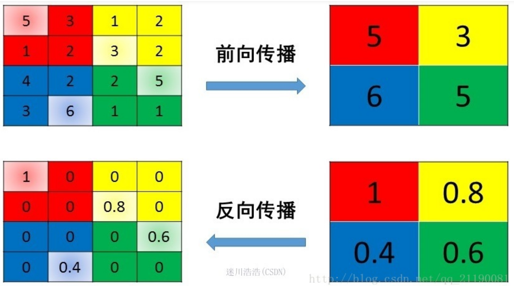
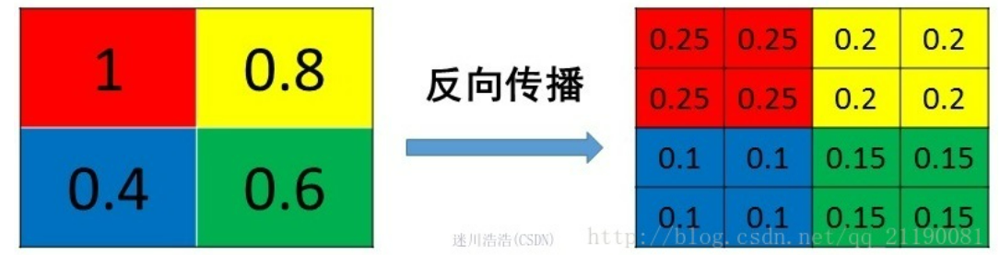

# 机器学习相关问题
+ 分类模型的预测值的概率分布在0.4-0.7之间，为什么不是0-1之间？
    + 问题解答：如果预测值概率低，但是模型的auc很高，说明置信度是比较低的，这样的话，结果的可解释性很差。
    + 欠拟合：分类器较弱，导致无法学到样本间差异；
        + 提升分类器复杂度
    + 测试样本分布与训练集不一致；
        + 样本选择采用分层抽样
    + 正常情况：由于样本集分布覆盖不足，缺少上下四分位样本
        + 扩充样本

+ 在数据量不足的情况，用哪种挖掘模型效果更好？
    + https://pic1.zhimg.com/d8d479d57d050e32c1d77bb859d61ce2_r.jpg?source=1940ef5c
    + 问题解答：这个问题一般可以理解为在特征维度较高、样本少的情况，即数据密度相当低。
    + 第一，维度很高，且数据量不足情况，模型仅仅是“记忆”数据，而不是去“学习”数据；
    + 第二，既然维度很高，说明数据更可能线性可分；
    + 所以，相对于高维下的数据量不足问题，使用线性分类器来解决问题。

+ 工业界，很少将连续值作为逻辑回归的特征输入，而是将其转换为one-hot形式，为什么？
    + **离散化特征对异常数据有强鲁棒性，比如年龄里30和300对模型会造成很大干扰(降噪)**
    + **单变量离散化后，相当于引入非线性，提升模型表达能力(特征维度空间更高了，特征就变得更加线性化了)**
    + 另外，最重要的一句话：**海量离散特征+简单模型、少量连续特征+复杂模型**
    + 离散化特征易于模型迭代
    + 稀疏向量內积乘法运算速度快，计算结果方便存储，容易扩展

## xgboost
+ xgboost为什么要泰勒展开，优势在哪里？
    + 有可能是为了xgboost库的可扩展性，因为可以自定义loss function
    
+ xgboost特征分裂时，样本是有放回还是无放回？
    + 样本是不放回的
    + 另外，由于xgboost也支持行采样，所以

+ xgboost如何处理缺失值？
    + 训练时，遇到缺失值，会计算缺失值属于左子树和右子树的增益，选择向增益最大的方向；
    + 预测时，默认向右子树（原因：代码实现使用了if-else）

+ xgboost的叶子节点是什么？xgboost的每颗树的输出是一个类别数大小的向量？

----

## 1*1卷积核的作用
+ 1*1的卷积核类似与全连接的作用类似
    + 升维和降维——改变了通道数
    + **跨channel交互，引入更多组合**
    + 非线性——主要取决于后面接不接激活函数

----

## max-pooling和mean-pooling的反向传播
+ max-pooling的反向传播
    + 梯度只回传到前向传播中值最大的位置，其余位置梯度为0
    
+ mean-pooling的反向传播
    + 将梯度平均分配到前向传播的每个位置中
    

----

## 池化以及激活的顺序如何考虑?
+ 对于max-pooling，池化和激活的顺序没有影响
+ 对于mean-pooling，有影响

## 为什么要先池化后激活？
+ 减少激活函数的计算量

----
## Layer Nomalization的作用？
+ 为了实现独立同分布：随着网络深度加深，层与层之间分布偏差越来越大，导致target层的分布与输入分布差距很大。而完全的白华操作代价高昂，特别是还希望白化操作是可微的，保证白化操作可以通过反向传播来更新梯度。

## 为什么RNN中不用Batch Normalization?
+ LN是对所有特征作归一化，
+ BN是对一列特征作归一化
+ 因为BN是对样本维度进行归一化的，对于文本来说，由于每个句子之间长度不一致，所以针对每一句缩放才更加合理。

----
## 残差网络有哪些作用？除了解决梯度消失？
+ 解决梯度消失
    + 当梯度过小时，残差网络的作用是对前一层进行一次线性堆叠，相当于减少了网络深度，使得梯度不容易因深度导致消失。
+ 解决网络退化：随着网络层数增加，训练集loss逐渐下降趋于饱和，再增加深度，训练集loss反而增大。
    + 在前向传播时，输入信号可以从任意低层传递到高层，由于存在一个恒等映射，一定程度上可以解决退化问题；
----
## 深度学习优化算法
+ 参考https://mp.weixin.qq.com/s/1PfnFHeuRUbHlGmhHjTJDg

----

## 线上线下评估效果不一致
+ 参考https://zhuanlan.zhihu.com/p/336959267
  + 特征是否穿越、过拟合现象
  + 离线指标不可信
  + 样本分布不一致  
      + 代码/操作bug：特征没对齐（上线前一致性检验—利用同一批特征测试线上线下模型输出差距）
      + 时间延迟：由于资源或通信问题，特征没及时更新
  + 业务问题：比如由其它场景模型更换导致的

